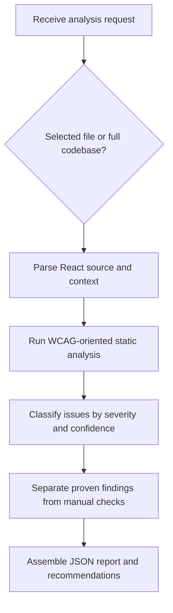

# React ADA Accessibility Analyzer Overview

## What This Agent Does
This agent analyzes React JSX and TSX for ADA and WCAG accessibility issues and produces a structured report. It is intended for assessment and prioritization, not direct code changes. Its output is useful for engineering review, triage, and stakeholder reporting.

## When To Use It
- Use it when you want accessibility findings without modifying code.
- Use it when you need a structured summary, issue list, and remediation guidance.
- Use it when route, entry-point, or shared-component context matters to the analysis.

## When Not To Use It
- Do not use it to directly fix code.
- Do not use it for non-React codebases.
- Do not use it to claim legal compliance or certification from static analysis alone.
- Do not use it as a substitute for full manual accessibility testing.

## How It Works
The agent asks whether the scope is a selected file or the full codebase, analyzes the available React source, classifies issues by severity and confidence, and produces a structured JSON report. It separates code-proven findings from manual checks so the final output does not overclaim confidence.

## Inputs It Expects
- Required:
  - `analysisMode`
- Required for `selected_file`:
  - `fileContent`
- Required for `full_codebase`:
  - `projectFiles`
- Optional:
  - `files`
  - `entryPoints`
  - `routes`
  - `designSystemFiles`
  - `packageJson`
  - `frameworkMeta`
  - `scanScope`
  - `componentPurpose`
  - `interactionType`
  - `focusAreas`
  - `complianceLevel`

Useful repository context:
- route definitions
- shared UI primitives
- application entry points
- package metadata
- tests that clarify intended interaction patterns

## Outputs It Produces
The agent returns a single JSON object. The output is analytical and prioritization-focused.

Main fields:
- `summary`
- `issues`
- `score`
- `recommendations`
- `manualChecks`
- `riskSummary`
- `report`

What to expect:
- JSON rather than prose-only output
- issue-level severity, confidence, impact, and remediation guidance
- a score used as a heuristic, not a certification
- manual checks for anything that cannot be proven from code alone

## Tools It Uses
- `codebase`: reads React files and surrounding repository context for analysis.

Important limit:
- The tool list is intentionally read-oriented. This agent is for analysis, not code editing.

## How To Prompt It
Good prompts define the scope clearly and provide enough source context for the analysis. If you want a selected-file review, include the component source. If you want broader analysis, include the relevant project files and any route or design-system context.

What to include:
- whether this is a selected-file or full-codebase review
- the component or project files
- any focus areas such as forms, keyboard access, or screen-reader support
- any known stakeholder constraints, such as prioritizing high-severity issues

Be specific:
- state whether you want triage, an executive summary, or detailed remediation guidance
- name the interaction type when relevant

What not to ask:
- do not ask it to apply fixes
- do not ask it to certify accessibility compliance
- do not ask it to infer runtime behavior that is not supported by code evidence

## Example Prompts
- `Analyze this JSX component for WCAG issues and highlight what needs manual verification.`
- `Run a full React codebase accessibility review and prioritize the top issues.`
- `Review these shared form components for screen-reader and keyboard risks.`
- `Generate an executive accessibility report with WCAG references for this selected file.`

## Limits And Guardrails
- It should not overclaim compliance.
- It should distinguish static findings from runtime-only concerns.
- It should prefer semantic HTML over ARIA in its recommendations.
- It should explain uncertainty rather than guessing.
- It should keep the report precise instead of noisy.

Manual testing is still needed for:
- focus order and restoration
- live regions and announcements
- motion and dynamic UI transitions
- browser- and assistive-technology-specific behavior
