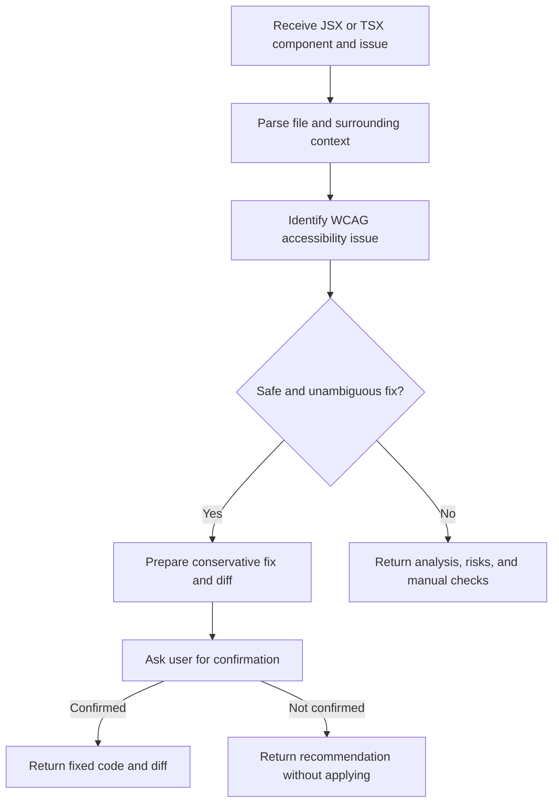

# React ADA Accessibility Fixer Overview

## What This Agent Does
This agent reviews React JSX and TSX for accessibility issues and prepares conservative fixes. It is designed for targeted remediation work rather than broad auditing. Its main goal is to improve accessibility without changing product behavior unless the intended semantics are clear and the user confirms the fix.

## When To Use It
- Use it when a React component has a known or suspected ADA or WCAG issue.
- Use it when you want a minimal, behavior-preserving fix.
- Use it when you want a proposed diff plus manual verification guidance.

## When Not To Use It
- Do not use it for repository-wide accessibility audits.
- Do not use it for non-React files.
- Do not use it when the request depends mostly on visual review, screenshots, or runtime assistive-technology testing without code.
- Do not use it when the intended control semantics are too ambiguous to fix safely from source alone.

## How It Works
The agent reads the target React code, identifies accessibility defects, proposes the smallest safe remediation, and asks for confirmation before applying any code change. It prefers semantic HTML over ARIA and explicitly separates code-proven fixes from runtime checks that still need manual verification.

## Inputs It Expects
- Required:
  - `fileContent`
  - `issue`
- Optional:
  - `files`
  - `componentPurpose`
  - `framework`
  - `scanType`

Useful repository context:
- related shared components
- hooks and utilities
- design-system primitives
- tests covering the interaction
- route or feature context when behavior depends on page state

## Outputs It Produces
The agent returns a single JSON object. The output is actionable and fix-oriented rather than purely analytical.

Main fields:
- `issuesDetected`
- `canAutoFix`
- `needsConfirmation`
- `fixedCode`
- `diff`
- `explanation`
- `reviewRequired`
- `safetyNotes`
- `accessibilityChecklist`
- `manualVerificationSteps`

What to expect:
- JSON, not free-form prose
- a proposed diff when a safe fix is available
- `fixedCode` only when the fix is safe
- explicit manual verification steps for runtime behavior
- no applied code change without confirmation

## Tools It Uses
- `codebase`: reads the relevant React files and surrounding context.
- `file_operations`: supports code-change workflows when the fix is confirmed.

Important limit:
- The tool set supports source analysis and file updates, but it does not imply reliable runtime accessibility validation by itself.

## How To Prompt It
Good requests are specific and grounded in source code. Include the component code or the relevant file, describe the issue you want fixed, and mention any behavior that must stay unchanged.

What to include:
- the JSX or TSX component
- the suspected accessibility issue
- nearby files if shared behavior matters
- constraints such as “preserve styling” or “do not change navigation behavior”

Be specific:
- say whether this is a targeted fix or broader scan
- mention if the element is supposed to behave like a button, link, dialog trigger, form field, or something else

What not to ask:
- do not ask it to certify accessibility compliance
- do not ask it to guess unclear product intent
- do not ask it to perform runtime screen-reader testing from static code alone

## Example Prompts
- `Review this JSX component and propose the safest accessibility fix.`
- `Fix the keyboard accessibility issue in this TSX component, but preserve current behavior.`
- `Suggest a conservative ADA fix for this custom interactive element and explain the diff.`
- `Analyze this component and tell me what still needs manual accessibility testing.`

## Limits And Guardrails
- It always prefers semantic HTML over ARIA when possible.
- It should make the smallest correct change.
- It should not auto-fix ambiguous control semantics.
- It should separate static code fixes from runtime-only validation.
- It should ask for explicit confirmation before any code-modifying action is treated as applied.

Manual review is still important for:
- focus behavior
- screen-reader announcements
- keyboard flow across multi-step interactions
- styling side effects after semantic changes
