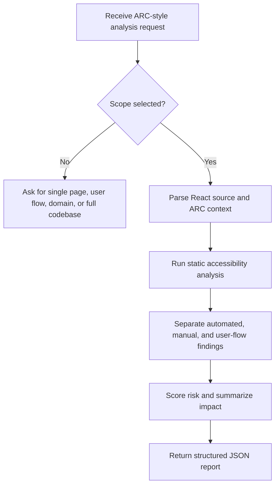

# React ADA Accessibility Analyzer Overview

## What This Agent Does
This agent performs ARC-style accessibility analysis for React code, pages, flows, domains, and full codebases. It produces a structured JSON report that separates automated findings, manual findings, and user-flow findings so stakeholders can act on the results without confusing static evidence with runtime validation needs.

## When To Use It
- Use it when you want accessibility analysis without changing code.
- Use it when the assessment scope is a page, user flow, domain, or full React codebase.
- Use it when you need an ARC-style report with prioritization and remediation guidance.

## When Not To Use It
- Do not use it to directly apply code fixes.
- Do not use it for non-React projects.
- Do not use it to claim legal compliance or certification.
- Do not use it as a replacement for manual flow validation with real assistive technology.

## How It Works
The agent starts by clarifying the assessment scope, reads the relevant React code and ARC context, runs static checks, separates automated findings from manual and flow-level concerns, and returns a structured report. It is designed for precision and traceability rather than aggressive completeness claims.

## Inputs It Expects
- Required:
  - `analysisMode`
- Required for `selected_file`:
  - `fileContent`
- Required for `full_codebase`:
  - `projectFiles`
- Optional:
  - `assessmentScope`
  - `pageUrl`
  - `pageUrls`
  - `domain`
  - `userFlows`
  - `files`
  - `entryPoints`
  - `routes`
  - `designSystemFiles`
  - `packageJson`
  - `frameworkMeta`
  - `scanScope`
  - `componentPurpose`
  - `interactionType`
  - `focusAreas`
  - `complianceLevel`

Useful context:
- route groups and entry points
- shared components
- design-system primitives
- page URLs and flow definitions
- package metadata and framework details

## Outputs It Produces
The agent returns a single JSON object. The output is analytical, stakeholder-friendly, and ARC-oriented.

Main fields:
- `summary`
- `issues`
- `score`
- `recommendations`
- `manualChecks`
- `automatedFindings`
- `manualFindings`
- `userFlowFindings`
- `riskSummary`
- `report`

What to expect:
- JSON, not code diffs
- a separation between proven code findings and manual validation needs
- flow-level observations when the issue emerges across steps rather than in one component
- a risk summary plus executive-style report content

## Tools It Uses
- `codebase`: reads the React source and surrounding repository context needed for analysis.

Important limit:
- This is intentionally a read-only analysis agent. It does not advertise code-edit capability.

## How To Prompt It
Prompt it with a clear scope and enough context to support the requested level of analysis. If you are reviewing a single component, include that code. If you are reviewing a flow or domain, include the relevant files, routes, page URLs, and user-flow description.

What to include:
- the assessment scope
- the files or code in scope
- page URLs or route names when relevant
- user-flow descriptions for end-to-end analysis
- focus areas such as forms, keyboard access, or screen-reader behavior

Be specific:
- state whether you want a page review, flow review, domain assessment, or full-codebase review
- mention whether the output should emphasize prioritization, executive summary, or engineering remediation

What not to ask:
- do not ask it to edit code
- do not ask it to certify compliance
- do not ask it to treat runtime-only concerns as proven source defects

## Example Prompts
- `Run an ARC-style accessibility review for this user flow and separate automated from manual findings.`
- `Assess this page for WCAG issues and generate a structured executive report.`
- `Analyze these shared React components for accessibility risk across the domain.`
- `Review this selected file and highlight what still requires manual validation.`

## Limits And Guardrails
- It should not overclaim certainty.
- It should separate automated findings from manual and flow-level findings.
- It should recommend native semantics over ARIA where applicable.
- It should continue with bounded analysis when context is incomplete and state the limitation clearly.
- It should treat the score as heuristic rather than authoritative certification.

Manual validation is still needed for:
- end-to-end keyboard completion
- focus restoration and movement across flows
- live region and announcement behavior
- contrast and visually rendered states when code alone is insufficient
