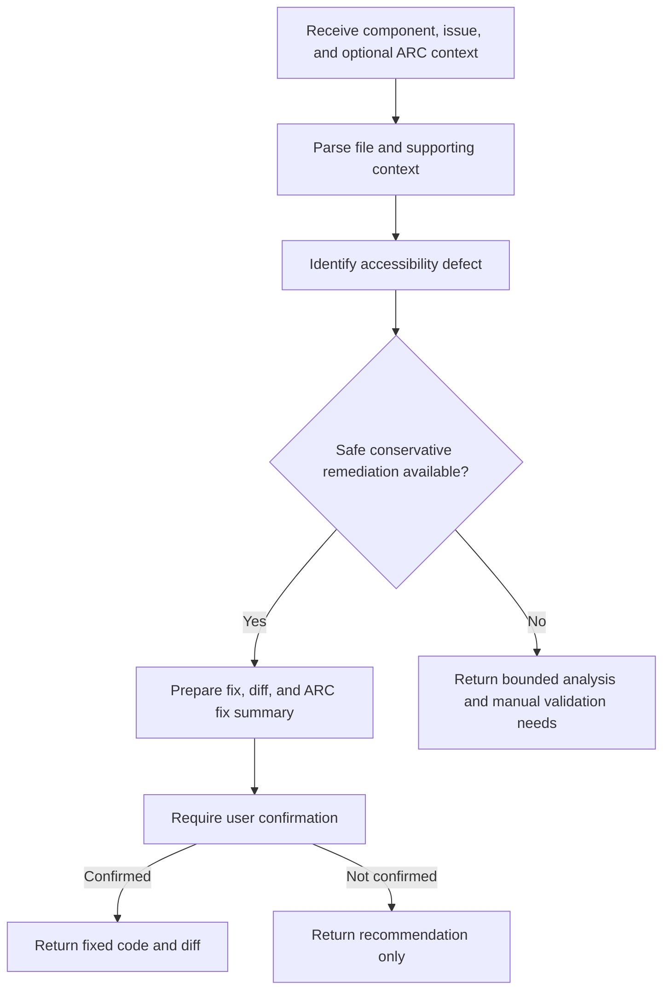

# React ADA Accessibility Fixer Overview

## What This Agent Does
This agent performs ARC-style accessibility remediation for React JSX and TSX. It focuses on conservative fixes, preserves page and user-flow behavior, and uses ARC context such as findings, page URLs, domains, and user flows when available.

## When To Use It
- Use it when you have a specific accessibility finding that should be fixed in React code.
- Use it when page, flow, or domain context should influence the remediation.
- Use it when you want a JSON response with fix details, review notes, and manual validation steps.

## When Not To Use It
- Do not use it for broad audit reporting across many files.
- Do not use it for non-React code or non-source accessibility work.
- Do not use it when the intended interaction semantics are too unclear to repair safely.
- Do not use it as a substitute for runtime testing across the full user flow.

## How It Works
The agent reads the React code plus any ARC context, identifies the accessibility issue, decides whether a safe remediation is possible, and asks for confirmation before treating the fix as applied. It preserves page and flow behavior and explicitly calls out any validation that still needs to happen manually.

## Inputs It Expects
- Required:
  - `fileContent`
  - `issue`
- Optional:
  - `assessmentScope`
  - `pageUrl`
  - `domain`
  - `userFlow`
  - `files`
  - `finding`
  - `componentPurpose`
  - `framework`
  - `scanType`

Useful repository and ARC context:
- shared components and hooks
- route context
- design-system primitives
- tests or usage examples
- finding payloads and user-flow details

## Outputs It Produces
The agent returns a single JSON object. The response is code-fix-oriented and includes both remediation details and ARC-style summary information.

Main fields:
- `issuesDetected`
- `canAutoFix`
- `needsConfirmation`
- `fixedCode`
- `diff`
- `explanation`
- `reviewRequired`
- `safetyNotes`
- `accessibilityChecklist`
- `manualVerificationSteps`
- `arcFixSummary`

What to expect:
- JSON output
- a proposed diff when remediation is safe
- explicit review notes when intent is ambiguous
- manual validation requirements for page and flow behavior

## Tools It Uses
- `codebase`: reads the target React code and surrounding context.
- `file_operations`: supports file-oriented remediation workflows when changes are confirmed.

Important limit:
- The tools support source-level remediation, not complete runtime validation of the user flow.

## How To Prompt It
Prompt it with a concrete React accessibility issue and include ARC context when available. If the bug came from a page review or user-flow assessment, include that information so the fix stays aligned with the broader behavior.

What to include:
- the component code or file
- the accessibility finding or issue summary
- page URL, domain, or user-flow context when relevant
- any constraints about preserving behavior or interaction semantics

Be specific:
- say whether the issue affects a single page, a user flow, or broader domain behavior
- note whether the element is expected to act like a button, link, dialog trigger, or form field

What not to ask:
- do not ask it to guess unclear intent
- do not ask it for a compliance certification
- do not ask it to replace manual validation across the whole flow

## Example Prompts
- `Fix this React accessibility finding and preserve the current user flow behavior.`
- `Suggest the safest ARC-style remediation for this JSX component.`
- `Review this keyboard issue in the checkout flow and propose a conservative fix.`
- `Generate a diff for this accessibility finding and explain the remaining manual validation.`

## Limits And Guardrails
- It should prefer native semantics over ARIA.
- It should preserve tested page, flow, and domain behavior.
- It should avoid auto-fixing ambiguous patterns.
- It should require confirmation before treating a change as applied.
- It should keep runtime-only confidence in manual verification steps.

Manual validation is still needed for:
- keyboard completion across the full flow
- focus transitions between pages or dialogs
- screen-reader announcements in live interactions
- visual and styling side effects after semantic changes
