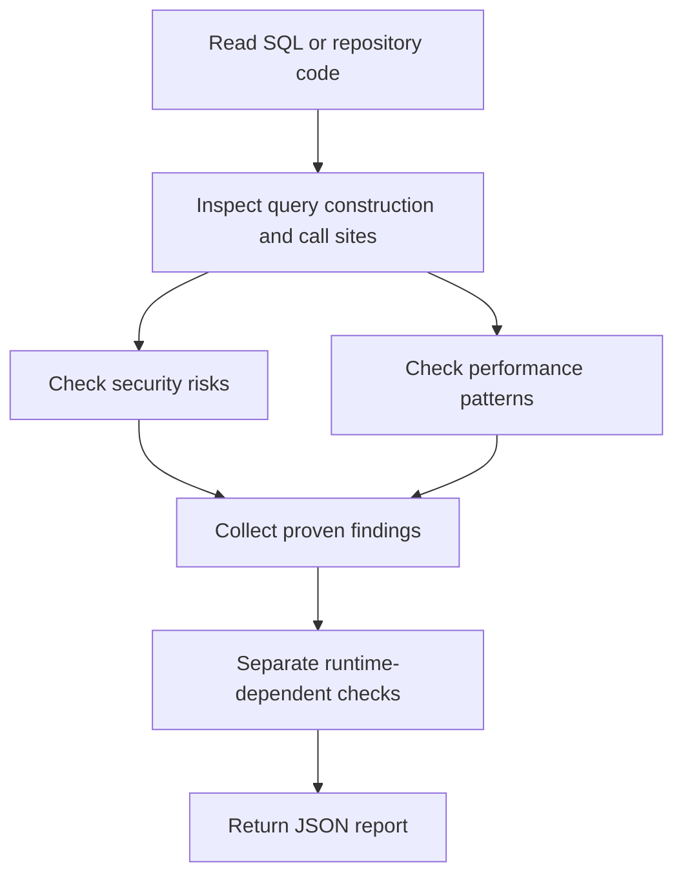

# Database Queries Analyzer Overview

## What This Agent Does
This agent reviews SQL, JDBC, and Spring Data query usage for security and performance risks. It is designed for source-based analysis, not automatic query rewriting.

## When To Use It
- Use it to review SQL injection risk.
- Use it to inspect slow or inefficient query patterns.
- Use it to identify likely indexing opportunities from code usage.

## When Not To Use It
- Do not use it as a schema migration tool.
- Do not use it to make firm production-performance claims without query plans or workload data.
- Do not use it for non-database business-logic review.

## How It Works
It reads query definitions and call sites, separates security findings from performance suggestions, and returns a structured JSON report. It keeps runtime-only advice in manual checks.

## Inputs It Expects
- SQL files, repositories, DAOs, or service-layer query call paths
- optional schema context
- optional database type and analysis focus

## Outputs It Produces
Main fields:
- `summary`
- `issues`
- `recommendations`
- `manualChecks`
- `riskSummary`
- `report`

The output is JSON and focuses on actionable review findings.

## Tools It Uses
- `codebase`: reads SQL, JDBC, and related repository code.

## How To Prompt It
Give it the query files or repository code, say whether the focus is security, performance, or indexing, and include schema context if available.

## Example Prompts
- `Analyze these repository queries for SQL injection risk.`
- `Review this DAO for inefficient query patterns.`
- `Suggest indexing opportunities for this service flow.`

## Limits And Guardrails
- It should not invent indexes without usage evidence.
- It should not overstate performance conclusions without runtime data.
- It should prefer bounded findings over speculative advice.
