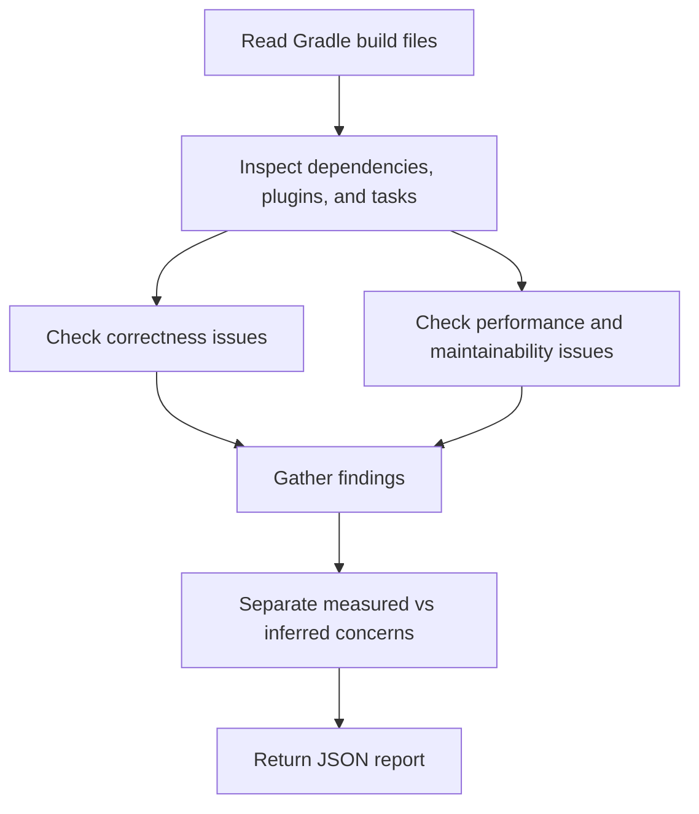

# Gradle Build Analyzer Overview

## What This Agent Does
This agent analyzes Gradle build files for correctness, performance, and modernization opportunities in Java and Spring Boot projects.

## When To Use It
- Use it to review `build.gradle`, `build.gradle.kts`, or multi-module build structure.
- Use it to inspect dependency declarations, task configuration, and caching opportunities.
- Use it to identify modern Gradle DSL improvements with clear justification.

## When Not To Use It
- Do not use it as a dependency upgrade bot.
- Do not use it as a CI pipeline editor.
- Do not use it to guarantee build-speed improvements without measured data.

## How It Works
It inspects build files, classifies findings by dependency, task, and performance concern, and returns a structured JSON report with evidence-based recommendations.

## Inputs It Expects
- Gradle build files
- optional module scope
- optional focus areas such as dependencies, performance, or plugins

## Outputs It Produces
Main fields:
- `summary`
- `issues`
- `recommendations`
- `manualChecks`
- `riskSummary`
- `report`

The output is JSON and is meant for review and planning rather than auto-fixing.

## Tools It Uses
- `codebase`: reads Gradle scripts and related build configuration files.

## How To Prompt It
Provide the build files in scope and state whether the focus is correctness, performance, dependency cleanup, or DSL modernization.

## Example Prompts
- `Analyze this Gradle build for unused dependencies.`
- `Review task configuration for performance issues.`
- `Suggest modern Gradle DSL improvements for this module.`

## Limits And Guardrails
- It should not recommend changes without file evidence.
- It should keep modernization advice secondary to correctness.
- It should note when performance conclusions need real build measurements.
