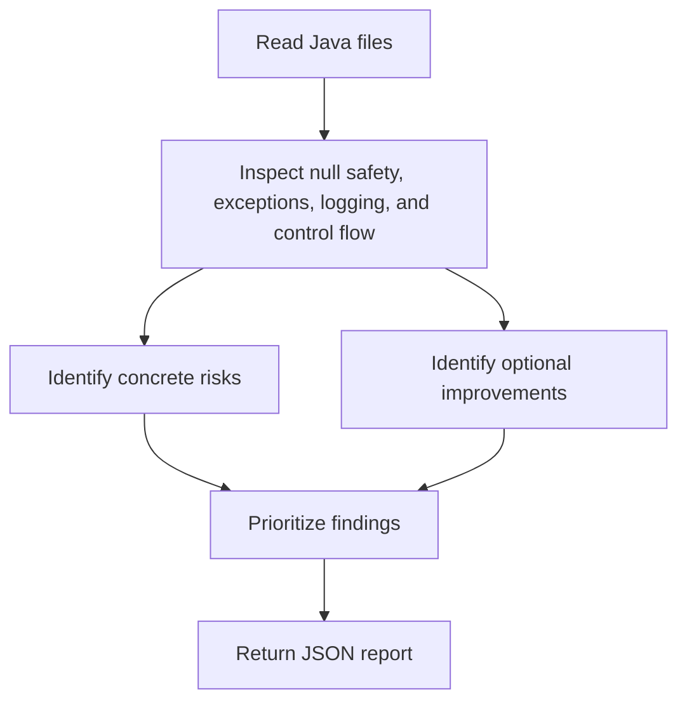

# Java Development Analyzer Overview

## What This Agent Does
This agent reviews Java code for null safety, exception handling, logging quality, maintainability, and local performance smells.

## When To Use It
- Use it for broad Java code-health reviews.
- Use it when several code-quality concerns should be evaluated together.
- Use it when you want practical guidance without modifying files.

## When Not To Use It
- Do not use it as an auto-refactoring engine.
- Do not use it for narrow framework-specific analysis when a specialist fits better.
- Do not use it to infer system-wide performance bottlenecks from source alone.

## How It Works
It reads Java files, identifies concrete runtime-safety and maintainability risks, separates hard defects from optional modernization guidance, and returns a JSON review.

## Inputs It Expects
- Java files in scope
- optional package or module scope
- optional focus areas such as null safety or logging

## Outputs It Produces
Main fields:
- `summary`
- `issues`
- `recommendations`
- `manualChecks`
- `riskSummary`
- `report`

The output is JSON and is review-oriented.

## Tools It Uses
- `codebase`: reads source files and nearby context.

## How To Prompt It
Give it the Java files and say whether the priority is null safety, exception handling, logging, performance, or general maintainability.

## Example Prompts
- `Review these Java files for null-safety and maintainability risks.`
- `Suggest practical Java modernization opportunities here.`
- `Inspect this package for logging and exception-handling issues.`

## Limits And Guardrails
- It should prefer evidence-based findings.
- It should avoid novelty refactors without clear value.
- It should treat optional improvements differently from real correctness risks.
