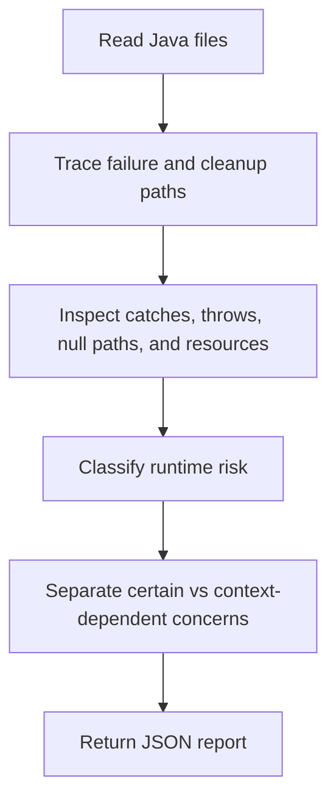

# Java Exception Analyzer Overview

## What This Agent Does
This agent focuses on Java runtime failure risks, especially exception handling, resource cleanup, null dereferencing, unsafe casts, and concurrency-related correctness concerns.

## When To Use It
- Use it when the main concern is failure handling.
- Use it when swallowed exceptions, generic catch blocks, or cleanup logic look suspicious.
- Use it when you want a focused risk review instead of a general code-quality review.

## When Not To Use It
- Do not use it as a general Java style analyzer.
- Do not use it as an automatic exception-refactoring tool.
- Do not use it for non-Java runtime issues.

## How It Works
It reads Java control-flow and error-handling paths, highlights production-facing failure risks, and returns a structured JSON report with focused remediation advice.

## Inputs It Expects
- Java files in scope
- optional entry points
- optional focus areas such as exceptions, resource handling, or concurrency

## Outputs It Produces
Main fields:
- `summary`
- `issues`
- `recommendations`
- `manualChecks`
- `riskSummary`
- `report`

The output is JSON and strongly centered on production failure behavior.

## Tools It Uses
- `codebase`: reads the relevant Java files and cross-file control flow.

## How To Prompt It
Provide the files and say whether the focus is swallowed exceptions, broad catch blocks, resource cleanup, or concurrency-related safety.

## Example Prompts
- `Inspect this Java code for exception-handling risks.`
- `Review resource cleanup and null-safety in this service flow.`
- `Check whether these concurrency paths are exception-safe.`

## Limits And Guardrails
- It should stay focused on runtime failure behavior.
- It should lower confidence when framework behavior is not visible.
- It should not treat speculative concurrency concerns as proven defects.
