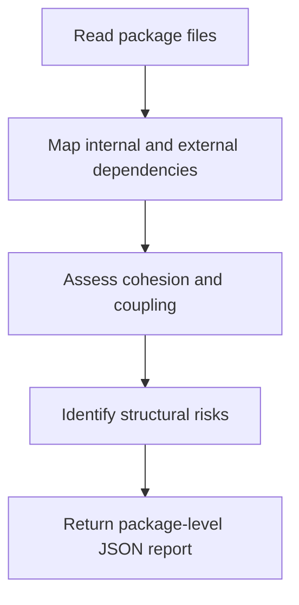

# Package Analyzer Overview

## What This Agent Does
This agent analyzes a Java package as a structural unit. It reviews cohesion, dependency direction, coupling, and package-level risks.

## When To Use It
- Use it before deep class-level analysis when package structure matters.
- Use it to understand architectural hotspots.
- Use it to establish context for narrower specialist agents.

## When Not To Use It
- Do not use it for line-level bug fixing.
- Do not use it outside package or module scope.
- Do not use it as a whole-repository architecture replacement when only one package is in scope.

## How It Works
It reads the package files, maps dependencies and responsibility boundaries, identifies structural smells, and returns a JSON summary with package-level recommendations.

## Inputs It Expects
- package files
- optional package name
- optional focus areas such as cohesion, coupling, or boundaries

## Outputs It Produces
Main fields:
- `summary`
- `issues`
- `recommendations`
- `manualChecks`
- `riskSummary`
- `report`

The output is JSON and package-architecture oriented.

## Tools It Uses
- `codebase`: reads package files and neighboring references.

## How To Prompt It
Provide the files from the target package and say whether the focus is cohesion, coupling, boundaries, or dependency flow.

## Example Prompts
- `Analyze this package for structural smells.`
- `Review package coupling and dependency direction here.`
- `Summarize risks in this Java package before deeper analysis.`

## Limits And Guardrails
- It should not overreach beyond the reviewed package scope.
- It should separate direct evidence from architectural inference.
- It should treat team-ownership assumptions as manual checks when needed.
