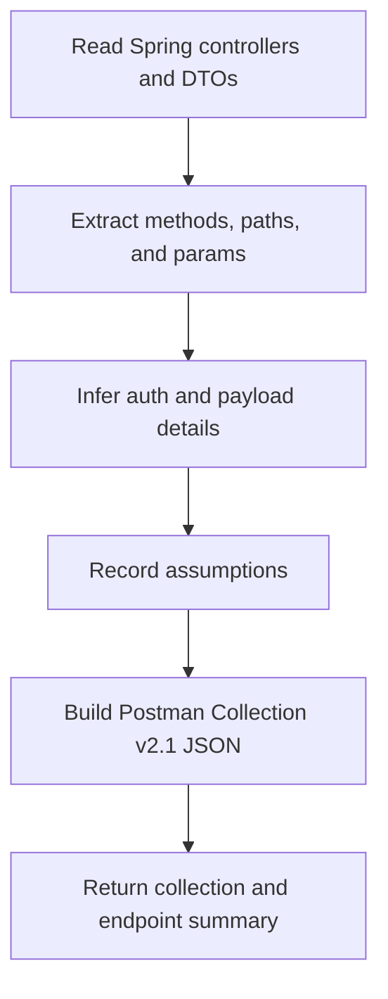

# Postman Collection Generator Overview

## What This Agent Does
This agent generates a Postman Collection v2.1 JSON artifact from Spring Boot REST controllers and related request or security context.

## When To Use It
- Use it when you want a Postman collection from controller code.
- Use it when you need endpoint grouping, path extraction, or inferred auth hints.
- Use it when the final output should be JSON rather than prose analysis.

## When Not To Use It
- Do not use it to invent undocumented endpoints or payloads.
- Do not use it as a full API contract validator when runtime behavior matters.
- Do not use it for non-controller sources unless the API structure is clearly represented in code.

## How It Works
It scans controllers and mappings, infers request structure where possible, captures assumptions, and returns a JSON object containing the generated Postman collection and endpoint summary.

## Inputs It Expects
- controller files
- related request and response DTOs
- optional auth mode or base URL variable preference

## Outputs It Produces
Main fields:
- `summary`
- `collection`
- `endpoints`
- `assumptions`
- `manualChecks`

The output is JSON and includes a valid Postman Collection v2.1 object.

## Tools It Uses
- `codebase`: reads controller mappings, DTOs, and related security hints.

## How To Prompt It
Provide the controllers in scope and say whether the collection is for selected controllers, a module, or the full API. Include auth expectations if you know them.

## Example Prompts
- `Generate a Postman collection from these Spring controllers.`
- `Build a collection for the /api/v1 endpoints only.`
- `Infer bearer auth and include a simple endpoint summary.`

## Limits And Guardrails
- It should not invent endpoints or bodies not supported by source.
- It should expose assumptions clearly when inference is partial.
- It should keep unresolved auth or payload details in manual checks.
