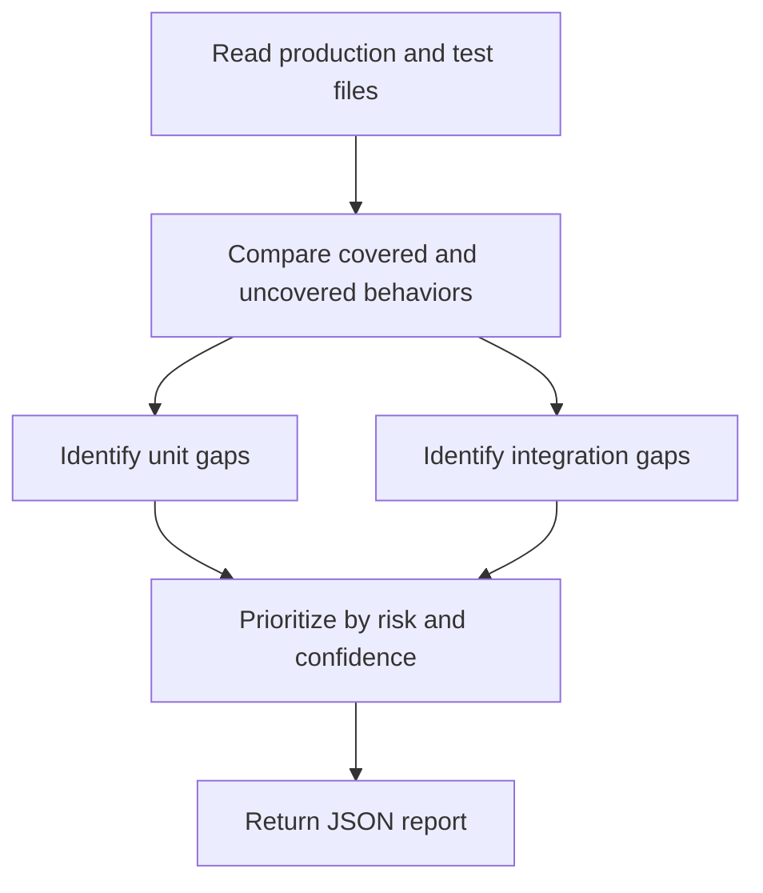

# Test Coverage Analyzer Overview

## What This Agent Does
This agent reviews Java production and test code to identify missing coverage, weak test layering, and high-value scenarios that are not currently exercised.

## When To Use It
- Use it to find meaningful unit and integration test gaps.
- Use it when you want prioritized coverage guidance rather than raw percentage output.
- Use it when edge cases and failure paths matter more than broad test count growth.

## When Not To Use It
- Do not use it as a full automatic test generator.
- Do not use it when a coverage tool percentage report is all you need.
- Do not use it to justify trivial tests with little confidence value.

## How It Works
It compares production behavior with current tests, identifies high-risk missing scenarios, separates unit and integration concerns, and returns a JSON report with prioritized testing advice.

## Inputs It Expects
- production files
- test files
- optional critical paths
- optional focus areas such as unit tests, integration tests, or edge cases

## Outputs It Produces
Main fields:
- `summary`
- `issues`
- `recommendations`
- `missingCoverageAreas`
- `manualChecks`
- `report`

The output is JSON and is meant for planning and review.

## Tools It Uses
- `codebase`: reads production and test files together.

## How To Prompt It
Provide both the production and test files in scope and say whether you want unit-test, integration-test, or edge-case analysis emphasized.

## Example Prompts
- `Identify the highest-value missing tests in this module.`
- `Review unit and integration coverage for this service package.`
- `Suggest edge cases that are currently untested here.`

## Limits And Guardrails
- It should prioritize confidence-improving tests over quantity.
- It should separate unit and integration guidance clearly.
- It should lower confidence when tests may exist outside the provided scope.
