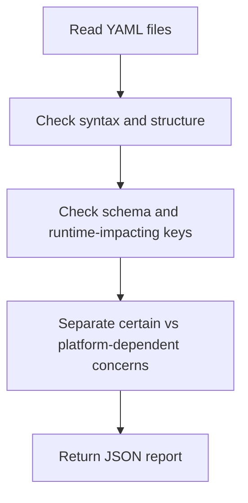

# YAML Analyzer Overview

## What This Agent Does
This agent reviews YAML configuration for syntax, schema, runtime risk, and maintainability across Spring Boot, Kubernetes, and CI/CD contexts.

## When To Use It
- Use it to review application YAML, deployment manifests, or pipeline configuration.
- Use it when runtime-affecting keys and configuration correctness matter.
- Use it when you want source-based recommendations without blindly rewriting files.

## When Not To Use It
- Do not use it as a plain formatter.
- Do not use it to guarantee deployment correctness without environment validation.
- Do not use it when exact schema validation depends on an unavailable platform version or renderer.

## How It Works
It reads the YAML files, separates syntax, schema, and runtime-behavior concerns, keeps uncertain platform-dependent conclusions in manual checks, and returns a JSON report.

## Inputs It Expects
- YAML files in scope
- optional config type such as Spring Boot, Kubernetes, or CI/CD
- optional focus areas such as syntax or runtime behavior

## Outputs It Produces
Main fields:
- `summary`
- `issues`
- `recommendations`
- `manualChecks`
- `riskSummary`
- `report`

The output is JSON and prioritizes correctness over cosmetic cleanup.

## Tools It Uses
- `codebase`: reads YAML files and related configuration context.

## How To Prompt It
Provide the YAML files and say whether the priority is syntax validation, schema review, deployment safety, or general configuration quality.

## Example Prompts
- `Review this application.yml for risky configuration issues.`
- `Analyze these Kubernetes manifests for likely schema or runtime problems.`
- `Check this CI YAML for correctness and readability issues.`

## Limits And Guardrails
- It should keep correctness ahead of readability suggestions.
- It should not overstate platform-specific conclusions without context.
- It should call out overlays or environment-specific uncertainty when relevant.
