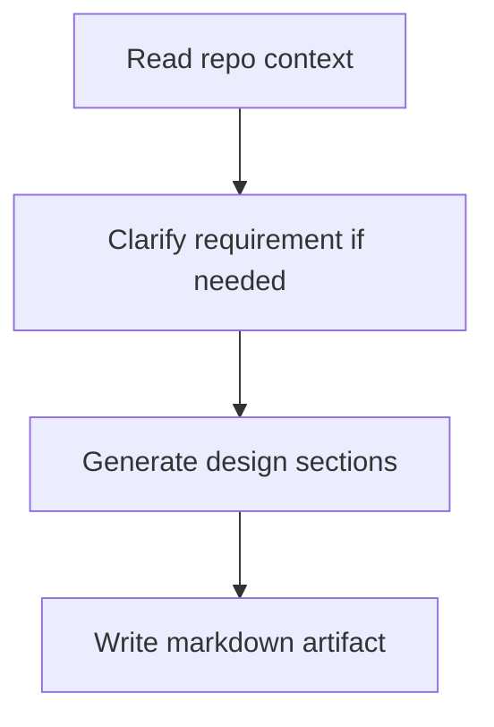

# Engineering Design Agent Overview

## What This Agent Does
This agent generates repo-aware engineering design artifacts such as BDD stories, HLD, LLD, test data, and Mermaid diagrams.

## When To Use It
- Use it for feature-design breakdowns.
- Use it when requirements need to become structured engineering documentation.

## When Not To Use It
- Do not use it for code fixes.
- Do not use it when the requirement is too vague to support meaningful artifacts without clarification.

## How It Works
It reads repository context, interprets the requirement, generates the requested artifact set, and writes the result under `docs/generated/`.

## Inputs It Expects
- requirement text
- optional project type, tech stack, or architecture type

## Outputs It Produces
- JSON summary
- saved markdown path
- generated section list and assumptions

## Tools It Uses
- `codebase`: reads repository context
- `file_operations`: writes the output markdown file

## How To Prompt It
Provide the requirement and state whether you want BDD stories, architecture design, a full design document, or a template.

## Example Prompts
- `Generate a full design document with BDD and test data for this feature.`

## Limits And Guardrails
- It should not invent repository context.
- It should make assumptions explicit when requirements are incomplete.
