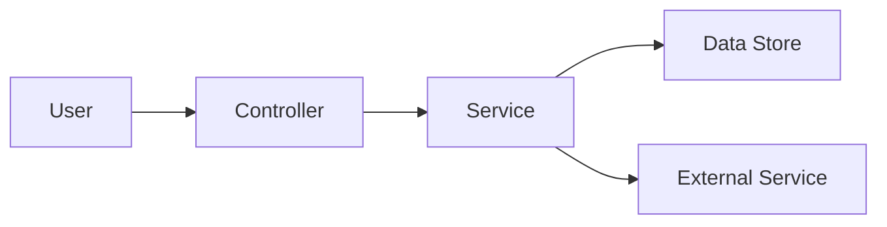
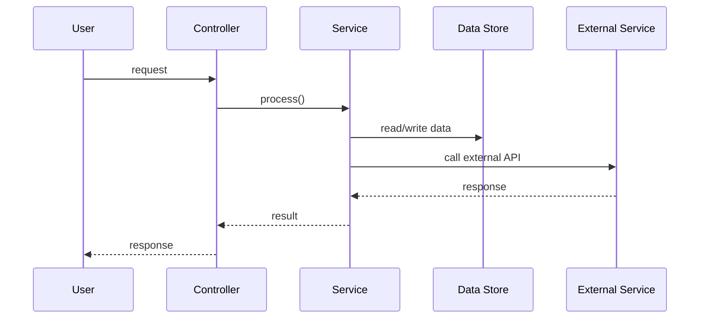

# [Feature Name]-design-bdd-breakdown

## Architecture Overview
[Summarize the feature in 2-4 sentences. State the goal, user value, and where it fits in the current system.]

## High-Level Design (HLD)
[Describe the overall solution, major components, and how they interact at a high level.]

## Low-Level Design (LLD)
### Components
- `[Component 1]`: [Responsibility]
- `[Component 2]`: [Responsibility]
- `[Component 3]`: [Responsibility]

### Data Model
`[table_or_entity_name]`
- `id`
- `[field_1]`
- `[field_2]`
- `[field_3]`

## Architecture Diagrams




## Epics
1. `[Epic 1 title]`
2. `[Epic 2 title]`

## User Stories (with Story Points)
### Story 1
As a `[persona]`, I want `[goal]` so that `[value]`.

- Story Points: `[1/2/3/5/8/13/21]`
- Notes: `[optional implementation notes]`

### Story 2
As a `[persona]`, I want `[goal]` so that `[value]`.

- Story Points: `[1/2/3/5/8/13/21]`
- Notes: `[optional implementation notes]`

## Subtasks
### Story 1 Subtasks
1. `[Subtask 1]`
2. `[Subtask 2]`
3. `[Subtask 3]`

### Story 2 Subtasks
1. `[Subtask 1]`
2. `[Subtask 2]`
3. `[Subtask 3]`

## BDD Scenarios
### Story 1
```gherkin
Feature: [Feature name]
  Scenario: [scenario title]
    Given [precondition]
    When [action]
    Then [expected outcome]

  Scenario: [scenario title]
    Given [precondition]
    When [action]
    Then [expected outcome]

  Scenario: [scenario title]
    Given [precondition]
    When [action]
    Then [expected outcome]
```

### Story 2
```gherkin
Feature: [Feature name]
  Scenario: [scenario title]
    Given [precondition]
    When [action]
    Then [expected outcome]

  Scenario: [scenario title]
    Given [precondition]
    When [action]
    Then [expected outcome]

  Scenario: [scenario title]
    Given [precondition]
    When [action]
    Then [expected outcome]
```

## Test Data
### Positive
- `[example input 1]`
- `[example input 2]`

### Negative
- `[invalid input 1]`
- `[invalid input 2]`

### Boundary
- `[boundary case 1]`
- `[boundary case 2]`

### Edge
- `[edge case 1]`
- `[edge case 2]`

## Tasks
- `[cross-cutting task 1]`
- `[cross-cutting task 2]`
- `[cross-cutting task 3]`

## Dependencies
- `[external system, team, or artifact 1]`
- `[external system, team, or artifact 2]`

## Execution Plan
1. `[step 1]`
2. `[step 2]`
3. `[step 3]`
4. `[step 4]`

## Risks
- `[risk 1]`
- `[risk 2]`

## Assumptions
- `[assumption 1]`
- `[assumption 2]`

## NFRs
- `[performance / security / logging / accessibility requirement 1]`
- `[performance / security / logging / accessibility requirement 2]`

## Estimation Summary
| Story | Points |
|---|---:|
| Story 1 | `[points]` |
| Story 2 | `[points]` |
| Total | `[sum]` |
