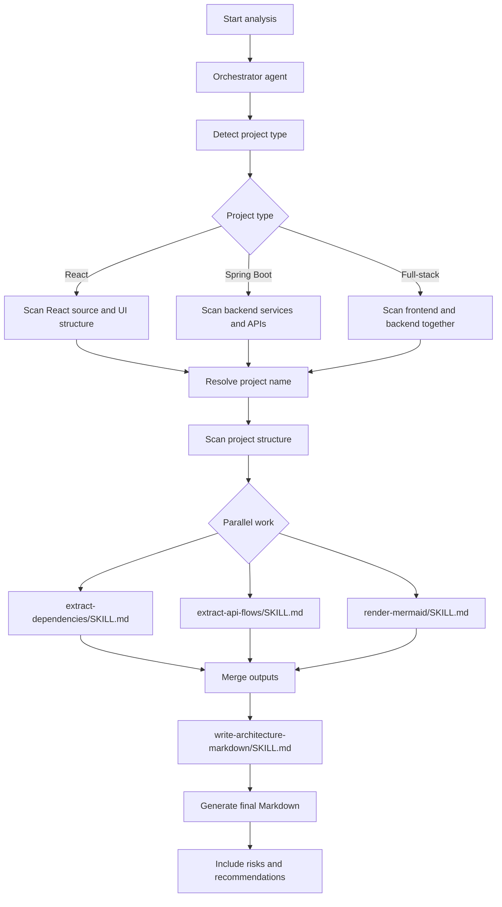

# Fullstack Project Architecture Analyzer - Instructions

## Overview

This folder contains the enterprise-grade instruction set that expands the JSON contract into an orchestrated agent architecture.

Key files:

- [`orchestrator/fullstack-project-architecture-orchestrator.agent.md`](fullstack-project-architecture-orchestrator.agent.md)
- [`sub-agents/`](sub-agents/)
- [`skills/`](skills/)

## Architecture

The instructions implement an agent-of-agents pattern:

- the orchestrator controls execution
- sub-agents handle specialized analysis tasks
- reusable skills provide decoupled capabilities

This layout supports:

- React analysis
- Spring Boot analysis
- full-stack analysis
- full-repo mode
- git diff mode
- parallel and sequential execution
- guided interaction
- retry and fallback behavior
- Mermaid diagram generation

## Flow Chart

## How To Use

Use the orchestrator when you want a presentation-ready architecture analysis workflow.

Typical flow:

1. Detect project type.
2. Resolve the project name.
3. Scan the project structure.
4. Run dependency mapping, process flow extraction, and diagram generation in parallel.
5. Merge results.
6. Generate the final Markdown document.

## Output

The final output is a Markdown architecture document with:

- Architecture Overview
- Technology Stack Summary
- System Context & External Integrations
- High-Level Design
- Low-Level Design
- Architecture Diagrams
- Flow Diagrams
- Component Responsibilities
- Dependency Mapping
- Risks and Recommendations

## Presentation Summary

Think of the instructions as the operating model:

- explicit
- modular
- presentation-ready
- optimized for enterprise architecture communication

## Notes

- This overview does not use a `scanMode` field.
- The actual branching is driven by project type only.
