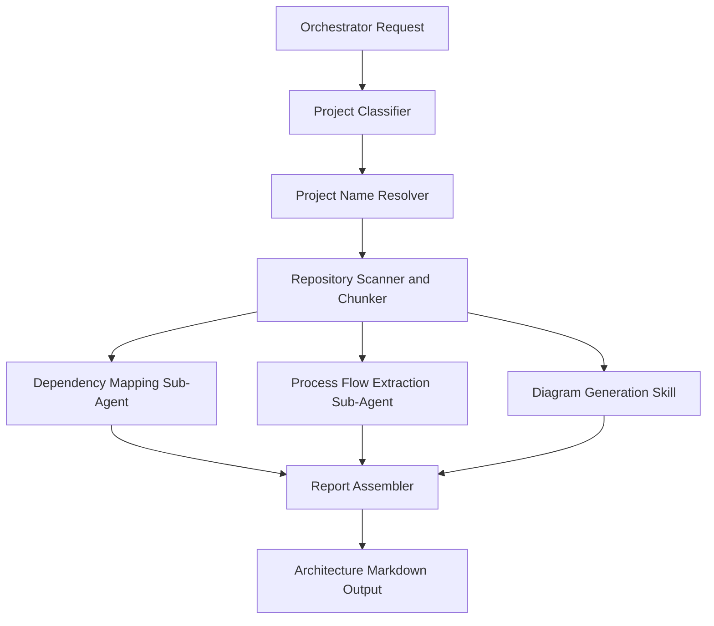

# Fullstack Project Architecture Orchestrator Overview

## What This Agent Does
This agent generates an architecture document for React, Spring Boot, or full-stack repositories, including diagrams and component structure.

## When To Use It
- Use it for architecture documentation.
- Use it when the output should be a production-ready markdown artifact.

## When Not To Use It
- Do not use it for narrow bug fixing.
- Do not use it when a lightweight summary is enough.

## How It Works
It acts like an orchestrator over a small set of analysis stages or sub-agent roles. It first classifies the repository and resolves the project name, then scans and chunks the codebase, runs dependency-mapping, process-flow, and diagram-generation work, and finally assembles the architecture document.

Main sub-agent or skill stages:
- `Project Classifier`: identifies whether the repo is React, Spring Boot, or full-stack.
- `Project Name Resolver`: derives the output name from repository evidence.
- `Repository Scanner and Chunker`: maps modules, boundaries, and analyzable scope.
- `Dependency Mapping Sub-Agent`: extracts dependency and component relationships.
- `Process Flow Extraction Sub-Agent`: identifies request, data, and control flows.
- `Diagram Generation Skill`: turns extracted structure and flows into Mermaid-ready diagrams.
- `Report Assembler`: merges all outputs into the final architecture document.

## Inputs It Expects
- repository root
- optional mode and focus

## Outputs It Produces
- JSON summary
- final architecture markdown path

## Tools It Uses
- `codebase`: reads repository structure
- `file_operations`: writes the architecture artifact

## How To Prompt It
Specify whether you want full-repo or diff mode and whether the focus is overall architecture, APIs, UI, or data flow.

## Example Prompts
- `Generate an architecture document for this full-stack repository.`

## Limits And Guardrails
- It should not invent components or dependencies.
- It should keep diagrams aligned with visible code structure.
