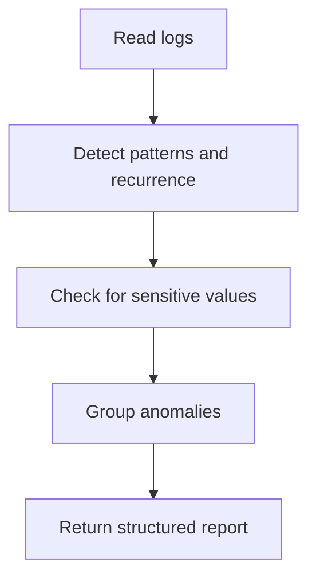

# Log Anomaly Detection Agent Overview

## What This Agent Does
This agent scans logs for recurring failures, anomaly clusters, performance signals, and observability gaps while protecting sensitive values.

## When To Use It
- Use it for incident-oriented log review.
- Use it for recurring error or anomaly analysis.

## When Not To Use It
- Do not use it as a source-code logging-style reviewer.
- Do not use it to sanitize logs without confirmation.

## How It Works
It reads the logs, detects anomaly groups, checks for PII or secrets, and returns structured findings with remediation.

## Inputs It Expects
- log files or pasted logs
- optional analysis priority

## Outputs It Produces
- JSON anomaly summary
- grouped anomaly findings
- remediation recommendations

## Tools It Uses
- `codebase`: reads log files
- `file_operations`: supports confirmed file-oriented sanitization workflows

## How To Prompt It
Provide the logs or file path and say whether the priority is incident review, performance signals, or logging quality.

## Example Prompts
- `Scan these logs for recurring anomalies.`
- `Analyze application.log for timeout clusters.`

## Limits And Guardrails
- It must not echo raw sensitive values.
- It must keep low-confidence root-cause guesses clearly marked.
