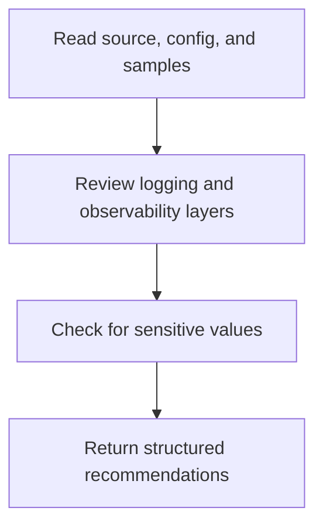

# Logging Monitoring Helper Overview

## What This Agent Does
This agent reviews Spring Boot logging, MDC, metrics, tracing, and monitoring readiness together.

## When To Use It
- Use it for observability maturity review.
- Use it when logging and monitoring need to be evaluated as one system.

## When Not To Use It
- Do not use it for narrow anomaly-only log review.
- Do not use it to rewrite logs without approval.

## How It Works
It inspects source, config, and optional log samples, then groups findings across logging, metrics, correlation, and tracing.

## Inputs It Expects
- source or config files
- optional log samples

## Outputs It Produces
- JSON observability summary with findings and recommendations

## Tools It Uses
- `codebase`: reads source, config, and logs
- `file_operations`: supports confirmed file-oriented workflows

## How To Prompt It
State whether the focus is MDC, metrics, tracing, log levels, or sensitive-data handling.

## Example Prompts
- `Review logging and monitoring readiness in this Spring service.`

## Limits And Guardrails
- It must never expose raw sensitive values.
- It should avoid recommending noisy logging without operational value.
