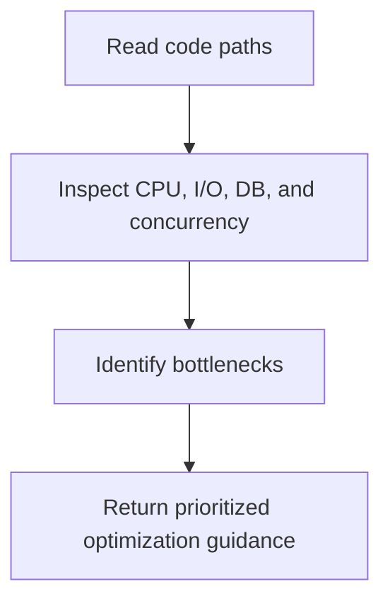

# Performance Optimizer Helper Overview

## What This Agent Does
This agent analyzes Java and Spring Boot code for performance bottlenecks and optimization opportunities.

## When To Use It
- Use it for hot-path review.
- Use it for blocking I/O, DB, concurrency, or caching analysis.

## When Not To Use It
- Do not use it as a load-testing tool.
- Do not use it for premature optimization without scope.

## How It Works
It reads the selected code, classifies bottlenecks by category, and returns a structured performance review.

## Inputs It Expects
- relevant Java or Spring files
- optional hot-path hints

## Outputs It Produces
- JSON report with findings, risk, and recommendations

## Tools It Uses
- `codebase`: reads the source and related execution paths

## How To Prompt It
Give it the performance-sensitive files and specify whether the focus is DB, caching, concurrency, or request latency.

## Example Prompts
- `Find performance bottlenecks in these services.`
- `Review this code for blocking I/O and concurrency issues.`

## Limits And Guardrails
- It should not overstate gains without measurement.
- It should keep correctness ahead of optimization.
