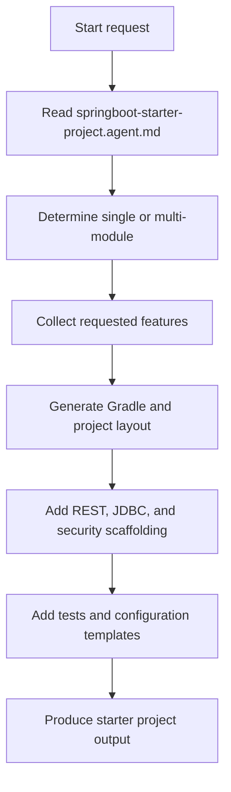

# Project Creation Agent Overview - Instructions

## Overview

This folder contains the markdown operating model for the `springboot-starter-project` agent.

## Files

- [`springboot-starter-project.agent.md`](springboot-starter-project.agent.md)

## Purpose

The instructions define how the agent should generate a Spring Boot starter project, including:
- project layout selection
- REST scaffolding
- JDBC scaffolding
- Spring Security baseline setup
- test scaffolding
- configuration templates

## Flow Chart

## Example Usage

- `@springboot-starter-project`
- `@springboot-starter-project projectType=single features=rest,jdbc,testing`
- `@springboot-starter-project projectType=multi features=rest,security,jdbc,actuator`

## Notes

- This folder currently contains one agent only: `springboot-starter-project`.
- The instruction file uses `Capabilities` instead of a separate `Skills` section.
- Keep the JSON trigger pattern and the markdown example usage aligned on `@springboot-starter-project`.
