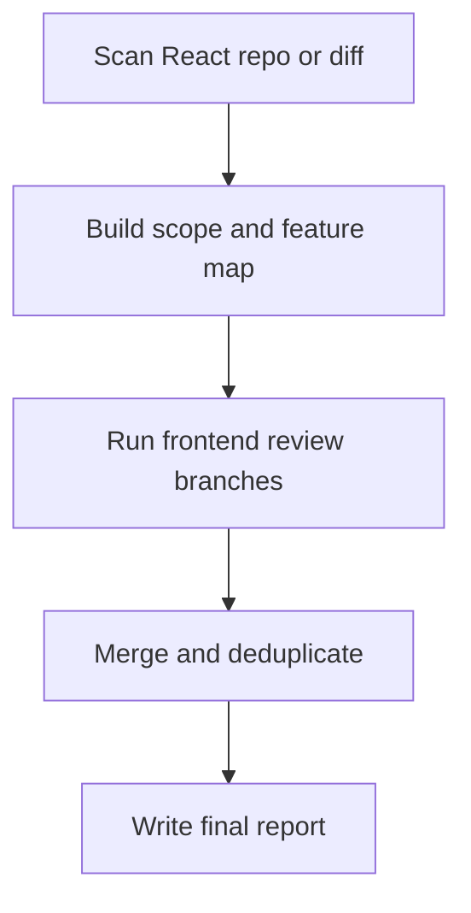

# React Codebase Analysis Agent Overview

## What This Agent Does
This agent performs broad React codebase analysis across multiple frontend concern areas and consolidates the result into one actionable report.

## When To Use It
- Use it for repository-wide or diff-wide React assessments.
- Use it when you need one combined report across architecture, state flow, routing, performance, dependency risk, and compliance.

## When Not To Use It
- Do not use it for narrow single-component analysis.
- Do not use it when a specialist React agent would be simpler and more precise.

## How It Works
It scans the repository, chunks scope when needed, runs scoped frontend review branches, then merges the findings into one consolidated result.

## Inputs It Expects
- repository root
- optional diff scope
- optional instruction source
- optional focus areas for frontend review

## Outputs It Produces
- JSON summary of scope, findings, and recommendations
- consolidated markdown report path

## Tools It Uses
- `codebase`: reads repository contents
- `file_operations`: writes the report artifact

## How To Prompt It
Give it the repository scope and say whether you want a full scan or diff scan. Mention the frontend focus areas if you want a weighted review, such as state flow, routing, performance, or testing posture.

## Example Prompts
- `Run a full React codebase review and produce one report.`
- `Analyze this frontend diff for state and dependency risk.`

## Limits And Guardrails
- It should not invent runtime or browser-only findings as proven facts.
- It should keep compliance separate from general code quality.
- It should qualify performance and accessibility conclusions when they depend on runtime evidence.
- It should not assume accessibility or testing packages exist unless they are present in the repository.
