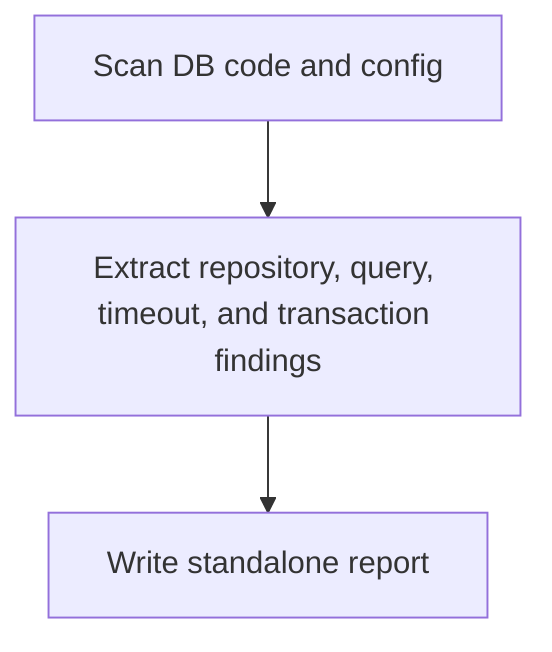

# Spring Backend DB Analyzer Overview

## What This Agent Does
This agent reviews Spring backend database access, query behavior, entities, transactions, timeout coverage, and DB logging, then writes a standalone report.

## When To Use It
- Use it for repository, JPA, or JDBC review.
- Use it when transaction boundaries or timeout handling need focused inspection.

## When Not To Use It
- Do not use it for broad backend architecture analysis.
- Do not use it to promise DB performance results from source alone.

## How It Works
It scans source and config, extracts database-access findings, then writes a report under `docs/`.

## Inputs It Expects
- project root
- optional DB focus areas

## Outputs It Produces
- JSON summary
- markdown report path

## Tools It Uses
- `codebase`: reads DB-related source and config
- `file_operations`: writes the report artifact

## How To Prompt It
Provide the project root and mention whether the focus is transactions, query behavior, entities, or timeouts.

## Example Prompts
- `Analyze database access and transaction risks in this backend.`

## Limits And Guardrails
- It should separate correctness risk from optimization suggestions.
- It should not invent schema or runtime behavior that is not visible.
