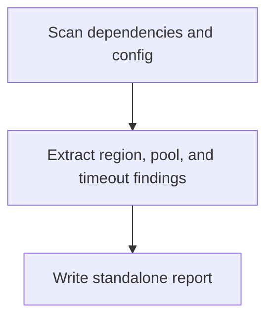

# Spring Backend GemFire Config Analyzer Overview

## What This Agent Does
This agent reviews Spring GemFire or Apache Geode configuration, including regions, pools, locators, serializers, expiration policies, and failover-related settings.

## When To Use It
- Use it when GemFire or Geode configuration is the main concern.
- Use it when you need a standalone configuration assessment.

## When Not To Use It
- Do not use it for generic caching review without GemFire or Geode.
- Do not use it when there is no GemFire or Geode integration.

## How It Works
It checks dependencies and configuration, extracts GemFire- or Geode-specific findings, and writes a markdown report.

## Inputs It Expects
- project root
- optional GemFire or Geode focus areas

## Outputs It Produces
- JSON summary
- markdown report path

## Tools It Uses
- `codebase`: reads config and code
- `file_operations`: writes the report artifact

## How To Prompt It
Provide the project root and say whether the focus is regions, pools, timeouts, or failover behavior.

## Example Prompts
- `Analyze GemFire configuration and failover-related settings in this backend.`

## Limits And Guardrails
- It should report absence clearly when GemFire or Geode is not present.
- It should not invent cluster behavior not visible in the available config.
