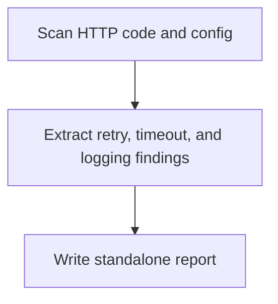

# Spring Backend HTTP Analyzer Overview

## What This Agent Does
This agent reviews Spring backend HTTP endpoints and outbound HTTP integrations, including retries, timeouts, logging, and error handling.

## When To Use It
- Use it for focused HTTP reliability review.
- Use it when you need a standalone report saved under `docs/`.

## When Not To Use It
- Do not use it for unrelated backend analysis.
- Do not use it when no relevant HTTP behavior is in scope.

## How It Works
It scans endpoint and client code, extracts resilience and supportability findings, and writes the report.

## Inputs It Expects
- project root
- optional HTTP focus areas

## Outputs It Produces
- JSON summary
- markdown report path

## Tools It Uses
- `codebase`: reads source and config
- `file_operations`: writes the report artifact

## How To Prompt It
Mention whether the focus is outbound clients, inbound endpoints, timeouts, retries, or circuit breakers.

## Example Prompts
- `Review HTTP clients and endpoint resilience in this backend.`

## Limits And Guardrails
- It should keep endpoint and client findings clearly separated when useful.
- It should not overstate runtime behavior absent from config or code.
