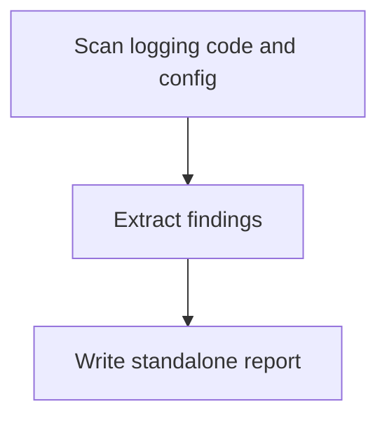

# Spring Backend Logging Analyzer Overview

## What This Agent Does
This agent reviews Spring backend logging practices around correlation IDs, masking, structured logging, and exception logging, then writes a standalone markdown report.

## When To Use It
- Use it for focused backend logging review.
- Use it when you want a standalone report saved under `docs/`.

## When Not To Use It
- Do not use it for general architecture analysis.
- Do not use it as a log anomaly detector.

## How It Works
It scans logging-related source and configuration, extracts focused findings, and writes a markdown report.

## Inputs It Expects
- Spring Boot project root
- optional logging focus areas

## Outputs It Produces
- JSON summary
- markdown report path

## Tools It Uses
- `codebase`: reads source and config
- `file_operations`: writes the report artifact

## How To Prompt It
Provide the project root and say whether the focus is correlation, masking, or exception logging.

## Example Prompts
- `Analyze backend logging for correlation and masking gaps.`

## Limits And Guardrails
- It should stay within logging scope.
- It should not claim behavior that is not visible in source or config.
