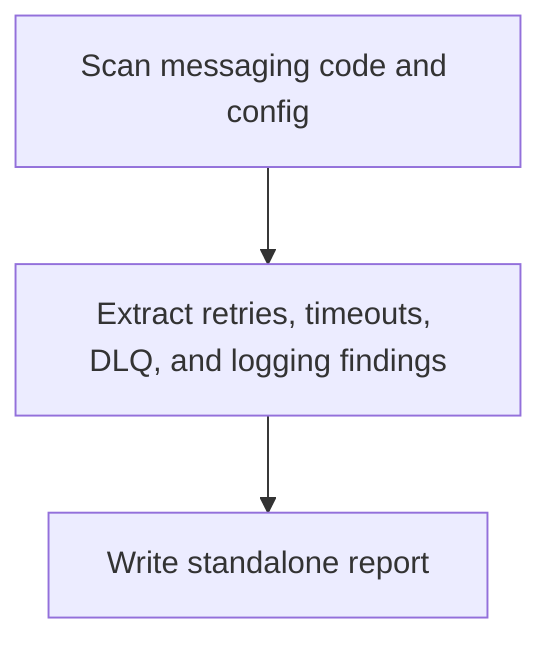

# Spring Backend Messaging Analyzer Overview

## What This Agent Does
This agent reviews Spring backend messaging integrations, retries, timeouts, dead-letter handling, and messaging-related logging, then writes a standalone report.

## When To Use It
- Use it for Kafka, queue, topic, producer, or consumer review.
- Use it when resilience around messaging needs focused analysis.

## When Not To Use It
- Do not use it for broad backend analysis outside messaging.
- Do not use it when no messaging infrastructure is present.

## How It Works
It scans messaging code and config, extracts findings about producers, consumers, and operational safeguards, then writes the report.

## Inputs It Expects
- project root
- optional messaging focus

## Outputs It Produces
- JSON summary
- markdown report path

## Tools It Uses
- `codebase`: reads source and config
- `file_operations`: writes the report artifact

## How To Prompt It
Provide the project root and say whether the focus is producer reliability, consumer handling, retries, or dead-letter coverage.

## Example Prompts
- `Analyze messaging retry and dead-letter handling in this backend.`

## Limits And Guardrails
- It should not invent broker behavior absent from code or config.
- It should keep findings scoped to messaging.
