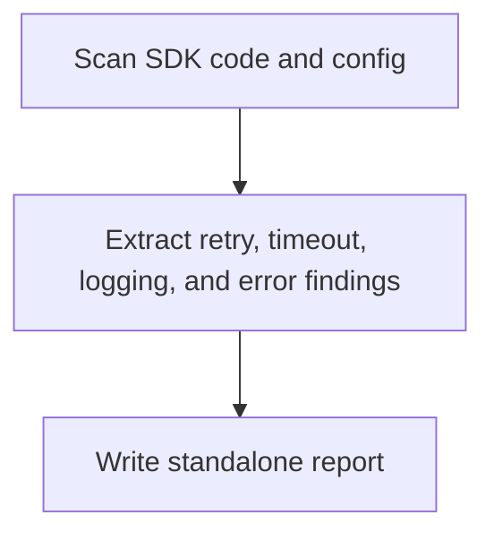

# Spring Backend SDK Analyzer Overview

## What This Agent Does
This agent reviews external SDK integrations such as cloud, payment, email, or vendor clients, focusing on timeouts, retries, logging, and error handling.

## When To Use It
- Use it for focused vendor-integration review.
- Use it when you need a standalone markdown report under `docs/`.

## When Not To Use It
- Do not use it for general backend analysis.
- Do not use it when there are no SDK integrations in scope.

## How It Works
It scans SDK-related code and config, extracts reliability and supportability findings, and writes the report.

## Inputs It Expects
- project root
- optional SDK focus areas

## Outputs It Produces
- JSON summary
- markdown report path

## Tools It Uses
- `codebase`: reads source and config
- `file_operations`: writes the report artifact

## How To Prompt It
Provide the project root and say whether the focus is retries, timeouts, error handling, or client configuration.

## Example Prompts
- `Analyze external SDK integrations for timeout and retry risk.`

## Limits And Guardrails
- It should keep findings scoped to actual SDK clients.
- It should not assume vendor behavior that is not visible in code or config.
