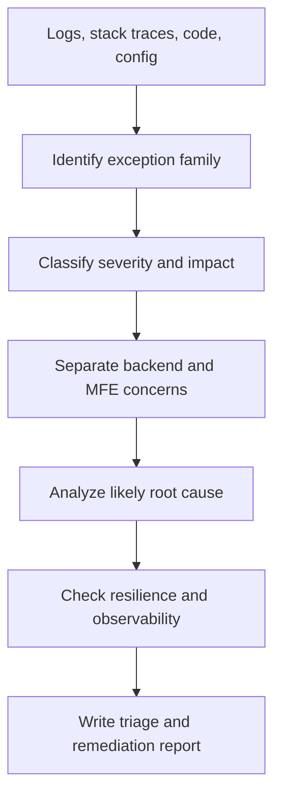

# Critical Exception SRE Check Agent Overview

## What This Agent Does
This agent performs production-style SRE analysis for critical exceptions across Spring Boot backend services and micro-frontend integration layers, then produces structured triage and remediation guidance.

## When To Use It
- Use it when incidents involve GraphQL, REST, JDBC, SSO, configuration, view resolution, or MFE integration failures.
- Use it when backend exceptions surface as broken user flows in an MFE.
- Use it when logs, stack traces, source code, and configuration all need to be reviewed together.

## When Not To Use It
- Do not use it for generic code-style review.
- Do not use it for frontend-only UI defects without backend or integration failures.
- Do not use it to claim a root cause that is unsupported by logs, code, or configuration evidence.

## How It Works
It identifies the exception family, classifies severity and user impact, separates service-layer and MFE-layer concerns, analyzes likely root causes, then produces fix, resilience, and observability guidance.

## Inputs It Expects
- repository root
- logs or stack traces
- optional diff scope or changed files
- relevant Spring Boot and integration source files
- configuration such as `application.yml` or `application.properties`
- optional incident context or affected endpoint details

## Outputs It Produces
- incident summary
- severity classification such as `P0`, `P1`, `P2`, or `P3`
- exception family and affected layer
- evidence-backed findings
- recommended code or configuration fixes
- resilience recommendations
- observability recommendations
- manual runtime follow-up checks

## Target Exception Areas
- GraphQL transport and endpoint configuration failures
- HTTP `500`, `502`, `504`, and integration failures
- JDBC connectivity, pool exhaustion, and SQL issues
- `NullPointerException`, `ClassCastException`, `StringIndexOutOfBoundsException`, `IllegalStateException`, and type-conversion failures
- SSO and authentication failures
- MFE integration, static resource, route, and view resolution failures

## How To Prompt It
Provide the repository or changed scope, include the exception text if available, and say whether the main concern is GraphQL, HTTP, JDBC, SSO, or MFE integration behavior.

## Example Prompts
- `Investigate GraphQlTransport failures and promo-fetch errors.`
- `Triage JDBC connection failures and repeated HTTP 500 responses.`
- `Analyze this MFE incident where downstream 502s break rendering.`
- `Review these Spring Boot logs for service-layer and MFE exception paths.`

## Limits And Guardrails
- It should not present runtime-only hypotheses as proven facts.
- It should separate backend and MFE responsibilities when both are involved.
- It should lower confidence when environment configuration or logs are missing.
- It should not recommend retries, fallbacks, or circuit breakers mechanically where they could hide the real defect.
