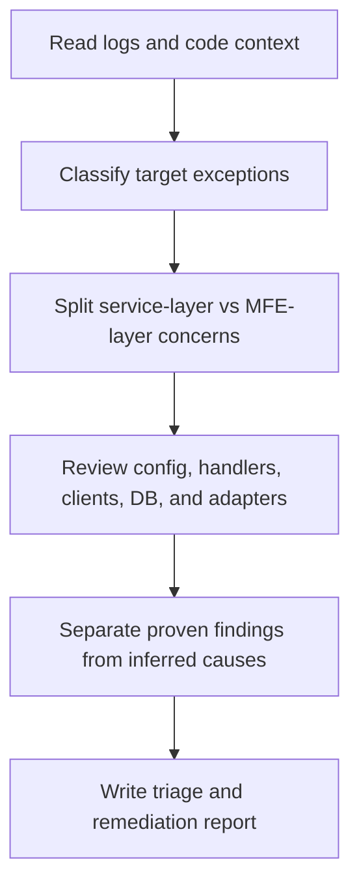

# Spring Boot MFE Exception Analyzer Overview

## What This Agent Does
This agent investigates critical exceptions across Spring Boot services and micro-frontend integration paths, then returns a structured triage and remediation report.

## When To Use It
- Use it when incidents involve GraphQL, REST, JDBC, SSO, view resolution, or MFE integration failures.
- Use it when you need one report that connects backend exceptions to user-facing MFE impact.
- Use it when stack traces, config, and code all need to be reviewed together.

## When Not To Use It
- Do not use it for generic code-style review.
- Do not use it for frontend-only UI defects without backend or integration failures.
- Do not use it to claim a root cause that is unsupported by logs or code.

## How It Works
It triages the incident, maps exceptions to service or MFE layers, reviews the relevant Spring Boot and integration code, and then produces one consolidated report.

## Inputs It Expects
- repository root
- optional incident logs or stack traces
- optional diff scope
- optional focus areas such as GraphQL, JDBC, HTTP, or MFE integration

## Outputs It Produces
Main fields:
- `summary`
- `triage`
- `findings`
- `recommendations`
- `manualChecks`
- `reportPath`

The output is JSON and centered on incident triage, root-cause analysis, and remediation planning.

## Target Exception Areas
- GraphQL transport and endpoint configuration failures
- HTTP `500`, `502`, `504`, and client or server integration failures
- JDBC connectivity, connection-pool, and SQL issues
- `NullPointerException`, `ClassCastException`, `StringIndexOutOfBoundsException`, `IllegalStateException`, and type-conversion failures
- SSO and authentication failures
- MFE integration, static resource, and view resolution failures

## Tools It Uses
- `codebase`: reads code and configuration
- `problems`: inspects surfaced repository problems
- `files`: writes the markdown report artifact
- `terminal`: supports targeted validation steps when needed

## How To Prompt It
Provide the repository or diff scope, include the key exception text if you have it, and say whether the main concern is GraphQL, HTTP, JDBC, SSO, or MFE integration behavior.

## Example Prompts
- `Investigate GraphQlTransport failures and promo-fetch errors.`
- `Triage JDBC connection failures and repeated HTTP 500 responses.`
- `Analyze this MFE incident where downstream 502s break rendering.`
- `Review these Spring Boot logs for service-layer and MFE exception paths.`

## Limits And Guardrails
- It should not present runtime-only hypotheses as proven facts.
- It should separate backend and MFE responsibilities when both are involved.
- It should lower confidence when environment configuration or logs are missing.
- It should not recommend resilience patterns mechanically where they could obscure the real defect.
