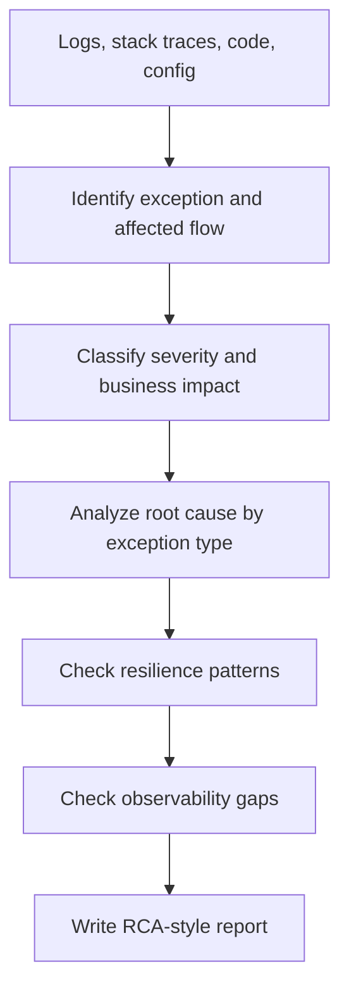

# Critical Exception SRE Check Agent Overview

## What This Agent Does
This agent analyzes critical exceptions in Spring Boot backend services and MFE components, then produces an RCA-style report with severity, root cause, fix guidance, resilience checks, and observability recommendations.

## When To Use It
- Use it for production-style exception review in Java and Spring Boot systems.
- Use it when the issue involves GraphQL, REST clients, JDBC, SSO, configuration, or MFE integration failures.
- Use it when you need triage plus concrete remediation guidance instead of a generic code review.

## When Not To Use It
- Do not use it for broad architecture analysis.
- Do not use it for UI-only styling issues or non-operational frontend concerns.
- Do not use it when a lightweight lint or code-quality pass is enough.

## How It Works
It reviews logs, stack traces, code, and configuration, identifies the failing layer and business impact, performs root cause analysis for the exception pattern, then produces a structured report with fix, resilience, and observability guidance.

## Inputs It Expects
- logs or stack traces
- relevant source files
- changed files or git diff when available
- configuration such as `application.yml` or `application.properties`
- optional incident context, endpoint, or user flow details

## Outputs It Produces
- severity classification from `P0` to `P3`
- identified exception type and affected layer
- likely root cause
- recommended code or configuration fix
- resilience recommendations
- observability recommendations
- final decision: `BLOCKER`, `MUST FIX`, `SHOULD FIX`, or `OBSERVATION`

## Target Exception Areas
- GraphQL transport and endpoint configuration failures
- HTTP `500`, `502`, `504`, and client/server integration failures
- JDBC, connection pool, and SQL issues
- `NullPointerException`, `ClassCastException`, `StringIndexOutOfBoundsException`, `IllegalStateException`, and type conversion failures
- SSO and authentication failures
- MFE integration, static resource, and view resolution failures

## How To Prompt It
Give it the exception symptom and the relevant files or logs. Mention whether you want focus on GraphQL, REST, DB, SSO, MFE, or general critical exception handling.

## Example Prompts
- `Analyze this Java file for critical exception handling.`
- `Check for GraphQL transport configuration issues.`
- `Verify database connection pool configuration.`
- `Find missing null checks causing NullPointerException.`
- `Check for type conversion issues with primitives.`
- `Verify BadSqlGrammarException SQL query issues.`
- `Analyze 502 Bad Gateway timeout configurations.`
- `Check WebClient error handling and retry logic.`
- `Find missing @Valid annotations for validation failures.`
- `Verify @ControllerAdvice exception handlers.`
- `Check for missing circuit breaker implementations.`
- `Analyze JDBC connection failure patterns.`
- `Verify error response format consistency for MFE.`
- `Check session attribute casting for ClassCastException.`

## Limits And Guardrails
- It should not invent runtime behavior that is not supported by logs or code evidence.
- It should not mark a finding as production-critical without a defensible impact path.
- It should not recommend retries, fallbacks, or circuit breakers blindly where they would be unsafe.
- It should not expose internal stack traces or secrets in recommended client responses.
