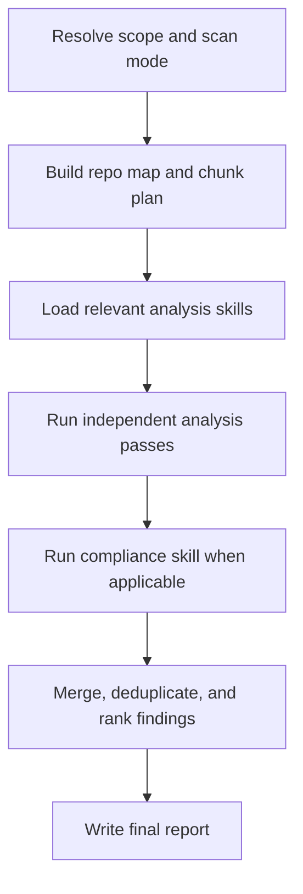

# Ultimate Codebase Analysis Agent Overview

## What This Agent Does
This agent coordinates independent codebase-analysis skills and consolidates their outputs into one actionable markdown report.

## When To Use It
- Use it for repository-wide or diff-wide technical assessments.
- Use it when you need one combined report across runtime risk, dependencies, performance, testing posture, security signals, and compliance.
- Use it when you want the analysis logic to stay reusable outside the agent.

## When Not To Use It
- Do not use it for narrow single-file analysis.
- Do not use it when a single focused skill is enough.
- Do not use it as the place where analyzer-specific logic lives.

## How It Works
It resolves scope first, scans and chunks the repository, loads only the needed independent analysis skills, then merges the findings into one final report.

## Skills It Coordinates
- `ultimate-codebase-analysis-intake`
- `ultimate-codebase-analysis-repo-scan`
- `ultimate-codebase-analysis-static-risk`
- `ultimate-codebase-analysis-exception-risk`
- `ultimate-codebase-analysis-dependency-health`
- `ultimate-codebase-analysis-performance-hotspots`
- `ultimate-codebase-analysis-instruction-compliance`
- `ultimate-codebase-analysis-report-assembler`

## Inputs It Expects
- repository root
- optional diff scope
- optional instruction source
- optional focus areas for runtime risk, dependencies, performance, testing, security, or compliance review

## Output It Produces
- consolidated markdown report path
- merged findings across the selected analysis skills

## Tools It Uses
- `codebase`: reads repository contents
- `file_operations`: writes the final report artifact

## How To Prompt It
Give it the repository scope and say whether you want a full scan or diff scan. Mention the focus areas if you want a weighted review.

## Example Prompts
- `Run a full codebase review and produce one report.`
- `Analyze this diff for runtime and dependency risk.`
- `Review this repository for testing and compliance concerns.`

## Limits And Guardrails
- It should not embed analyzer-specific logic that belongs in a skill.
- It should not invent findings or missing repository structure.
- It should keep compliance separate from general code quality.
- It should load only the skills justified by the request and repository evidence.
