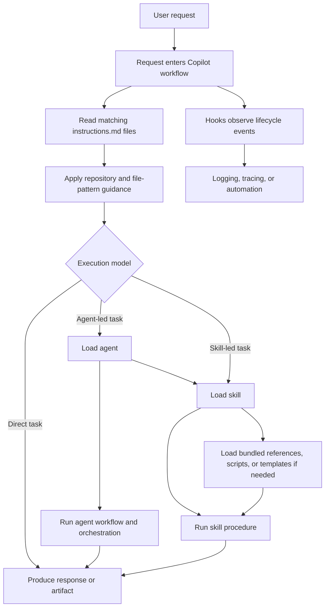
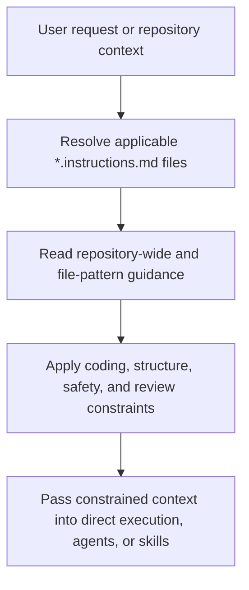
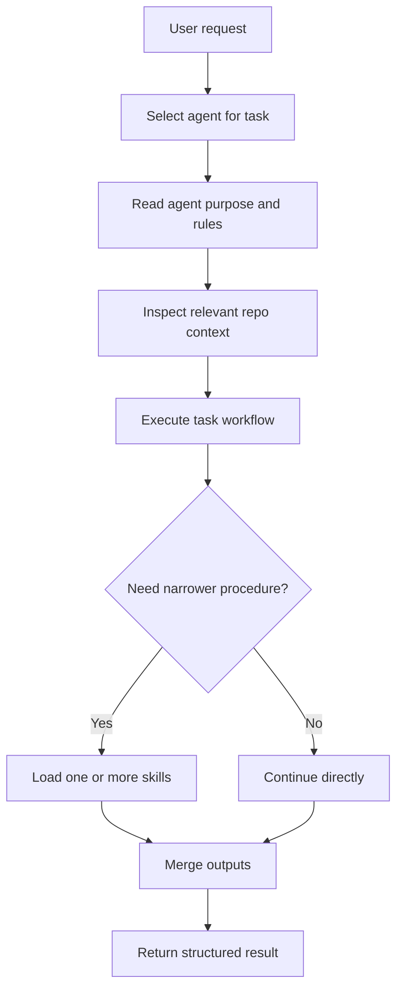
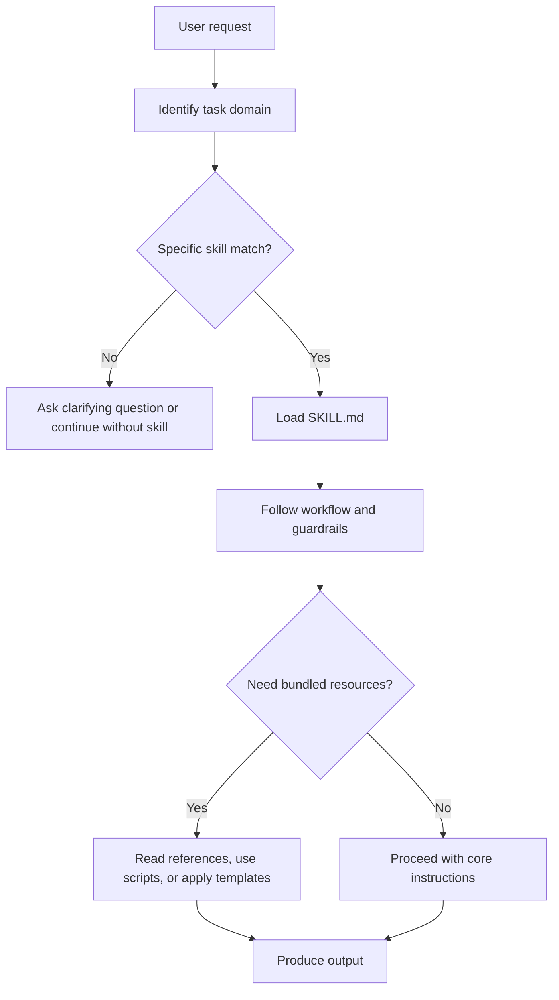
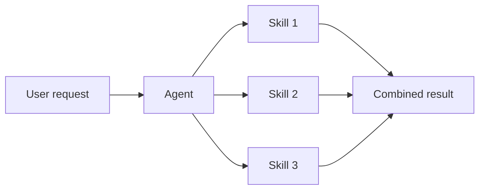
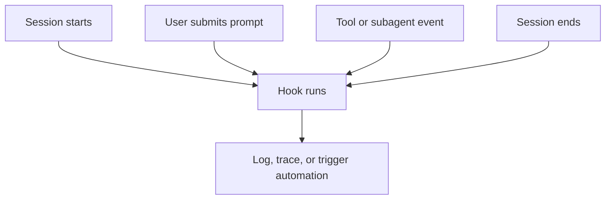
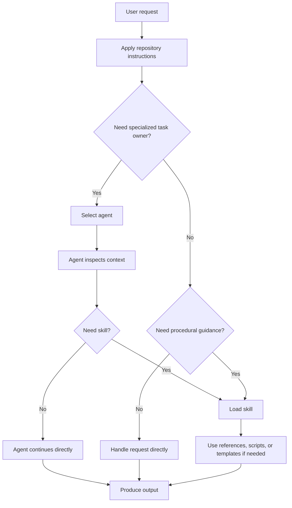

# Copilot Ecosystem Overview

This document provides a generic overview of how instructions, agents, skills, hooks, workflows, and plugins interact within this repository.

## Index

- [At a Glance](#at-a-glance)
- [Core Building Blocks](#core-building-blocks)
  - [Instructions](#instructions)
  - [Agents](#agents)
  - [Skills](#skills)
  - [Hooks](#hooks)
  - [Workflows](#workflows)
  - [Plugins](#plugins)
- [How Instructions Work](#how-instructions-work)
- [How Agents Work](#how-agents-work)
- [How Skills Work](#how-skills-work)
- [How Agents and Skills Relate](#how-agents-and-skills-relate)
- [How Hooks Fit In](#how-hooks-fit-in)
- [Typical Task Flow](#typical-task-flow)
- [Repository Layout](#repository-layout)
- [Reading Order](#reading-order)
- [Practical Rule of Thumb](#practical-rule-of-thumb)

## At a Glance



## Core Building Blocks

### Instructions

Instructions provide repository-level and file-pattern-specific guidance. They define how Copilot should behave for a given category of work.

Typical uses:

- apply coding standards to matching files
- provide repository-wide conventions
- set expectations for style, structure, or review rules

In this repository, instruction files live under `github/instructions/` and use the `*.instructions.md` format.

### Agents

Agents are specialized task executors. An agent typically has a focused purpose, a clear output contract, and its own operating rules.

Typical uses:

- orchestrate a complex task
- analyze a codebase or module
- generate a structured artifact
- coordinate substeps and merge results

In this repository, agent files live under `github/agents/` and use the `*.agent.md` format.

### Skills

Skills are reusable procedural guides. A skill explains how to perform a task well, usually through a step-by-step workflow, guardrails, output standards, and optional bundled assets.

Typical uses:

- guide a repeated engineering task
- progressively load specialized knowledge
- provide templates, scripts, or references for a domain-specific workflow

In this repository, skills live under `github/skills/<skill-name>/SKILL.md`.

### Hooks

Hooks are event-driven automations that run around session or tool activity.

Typical uses:

- log session activity
- trace subagent or tool usage
- capture audit or analytics events

In this repository, hooks live under `hooks/<hook-name>/` as a `README.md` plus `hooks.json`.

### Workflows

Workflows are agentic automation documents for GitHub Actions use cases.

Typical uses:

- automate recurring repository tasks
- define AI-driven operational flows in CI or GitHub automation

In this repository, workflows live under `workflows/` as `.md` files.

### Plugins

Plugins package related agents, skills, and commands into an installable unit.

Typical uses:

- publish a coherent capability set
- group domain-specific resources for discovery and installation

In this repository, plugins live under `plugins/`.

## How Instructions Work

Instructions are the policy and convention layer of the Copilot ecosystem. They are evaluated early in the request lifecycle and establish the repository-specific constraints that later agent or skill execution should follow.



Instructions typically define:

- file pattern matching
- coding and formatting expectations
- repository-specific constraints
- review or quality rules

Instructions do not usually own task execution. Their role is to establish the operating boundaries, quality expectations, and local conventions that shape how the rest of the system behaves.

## How Agents Work

Agents are typically selected when a task needs a dedicated role, an explicit output format, or orchestration across several steps.



An agent typically defines:

- purpose
- when to use and when not to use
- required and optional inputs
- output contract
- verification steps
- ambiguity handling

Agents are a good fit when:

- the task needs orchestration
- the output must follow a strict schema
- the work spans multiple concerns
- the task benefits from a dedicated operating mode

## How Skills Work

Skills are typically loaded when a request matches a known task pattern and a reusable procedure would improve quality, consistency, or efficiency.



A skill typically defines:

- frontmatter with `name` and `description`
- a clear task goal
- prerequisites
- step-by-step workflow
- output standard
- guardrails
- optional references, scripts, or templates

Skills are a good fit when:

- the task repeats often
- the task benefits from a reusable procedure
- the task needs progressive disclosure
- the task needs bundled assets or scripts

## How Agents and Skills Relate

Agents and skills address different concerns within the same execution model.

- An agent is usually the task owner.
- A skill is usually the procedural guide.

Common patterns:

1. A user request matches a single skill directly.
2. A user request selects an agent, and the agent uses one or more skills internally.
3. An agent coordinates multiple narrower skills and merges their outputs.



As a practical rule:

- use an agent when you need orchestration or a strong output contract
- use a skill when you need a reusable procedure
- use both when the task is complex and benefits from layered guidance

## How Hooks Fit In

Hooks are not the task logic itself. They observe or automate around lifecycle events.



Hooks are commonly used for:

- observability
- audit trails
- automation around prompts or tool usage
- operational metrics

## Typical Task Flow

The common end-to-end model looks like this:



## Repository Layout

The top-level resource layout in this repository is:

```text
github/agents/         agent definitions
github/instructions/   instruction files
github/skills/         skill folders with SKILL.md
hooks/                 hook folders
workflows/             workflow documents
plugins/               installable plugin packages
docs/                  supporting documentation
```

## Reading Order

When trying to understand a capability in this repository, use this reading order:

1. Read the relevant instruction file for repository-wide rules.
2. Read the agent file if the task is agent-driven.
3. Read the skill `SKILL.md` if the task is skill-driven or agent-assisted.
4. Read any bundled docs, references, or templates only when needed.
5. Read hook or workflow docs only if you need lifecycle or automation behavior.

## Practical Rule of Thumb

- Instructions define the rules.
- Agents own the task.
- Skills explain how to do the task well.
- Hooks observe or automate around the task.
- Workflows automate repeated repository operations.
- Plugins package capabilities for installation and reuse.

Together, these layers provide a structured way to define behavior, execute specialized tasks, reuse procedural knowledge, and automate supporting lifecycle events.
