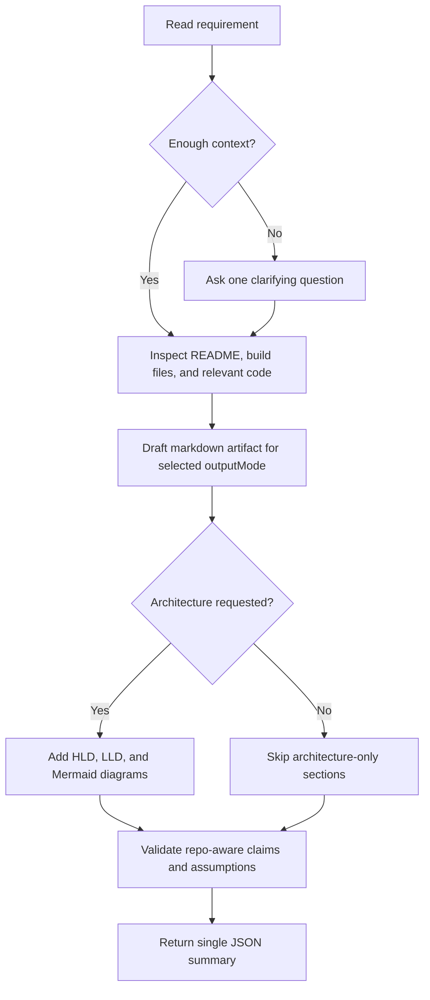

# Engineering Design Agent Skill Overview

## What This Skill Does
This skill coordinates repo-aware engineering design output. It turns a requirement into a markdown artifact such as BDD guidance, architecture design, or a full design document, then returns a final JSON summary.

## When To Use It
- Use it when feature requirements need to become structured engineering documentation.
- Use it when the output should align with the repository's visible stack and conventions.
- Use it when you need BDD, HLD, LLD, test-data guidance, or Mermaid diagrams.

## When Not To Use It
- Do not use it for code fixes or source review.
- Do not use it when the requirement is too vague to support useful design output without clarification.

## Inputs It Expects
- `requirement`
- optional `projectType`
- optional `techStack`
- optional `architectureType`
- optional `outputMode`: `bdd`, `architecture`, `full_design`, `template`

## How It Works
The coordinator progressively loads smaller skills to confirm the request, inspect repo context, draft the artifact, and validate the final JSON contract.



## Progressive Loading
1. [engineering-design-intake](./engineering-design-intake-skill-overview.md)
2. [engineering-design-scope](./engineering-design-scope-skill-overview.md)
3. [engineering-design-planning](./engineering-design-planning-skill-overview.md)
4. [engineering-design-validation](./engineering-design-validation-skill-overview.md)
5. [engineering-design-architecture](./engineering-design-architecture-skill-overview.md) when architecture output is required

## Outputs It Produces
- markdown artifact path
- `artifactType`
- `sectionsGenerated`
- explicit assumptions
- final JSON summary

## Output Contract

```json
{
  "summary": "Generated a repo-aware design artifact.",
  "artifactType": "full_design",
  "sectionsGenerated": [
    "Architecture Overview",
    "High-Level Design",
    "BDD Scenarios"
  ],
  "outputPath": "docs/generated/example-design.md",
  "assumptions": [
    "Architecture guidance was limited to visible repository context."
  ]
}
```

## Guardrails
- Do not invent repository context.
- Do not hide assumptions in prose.
- Do not return extra text outside the JSON object when using the skill contract.

