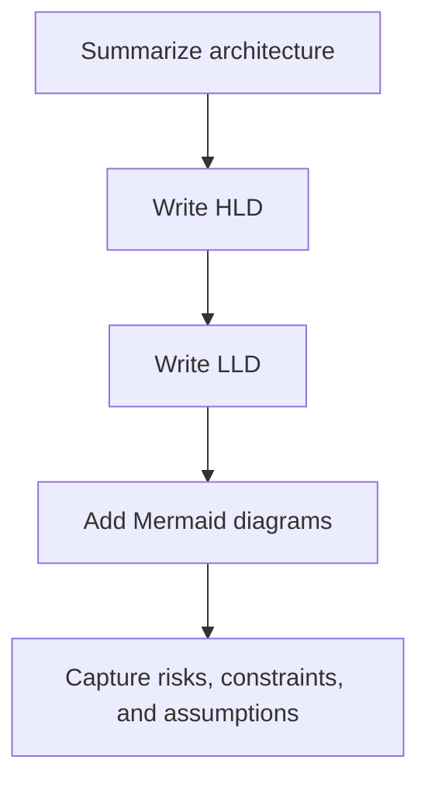

# Engineering Design Architecture Skill Overview

## What This Skill Does
This skill produces architecture-focused sections for engineering design output, including overview, HLD, LLD, risks, and Mermaid diagrams.

## When To Use It
- Use it when `outputMode` is `architecture` or `full_design`.
- Use it when the requirement explicitly asks for technical design structure.

## Inputs It Expects
- feature summary
- assumptions
- repo context summary
- optional `architectureType`

## How It Works

## Outputs It Produces
- architecture overview
- HLD
- LLD
- diagrams
- risks
- assumptions

## Guardrails
- Do not invent components or integrations not supported by repo context or user input.
- Do not skip diagrams when architecture output is explicitly requested.

