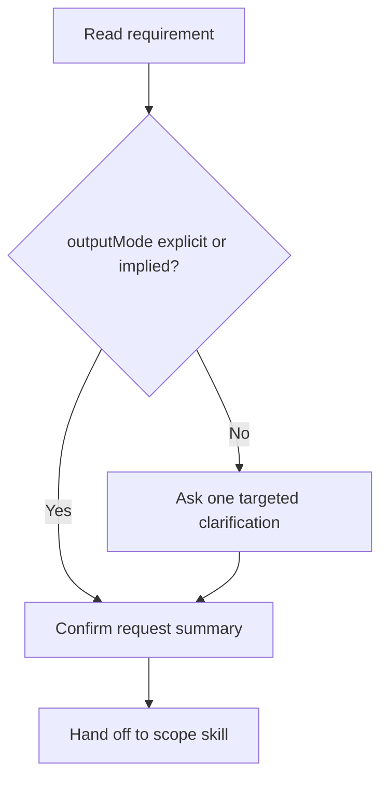

# Engineering Design Intake Skill Overview

## What This Skill Does
This skill confirms the requirement and gathers only the minimum missing inputs before design drafting begins.

## When To Use It
- Use it when the request is missing `outputMode` or design intent.
- Use it when the requirement is broad enough that one clarifying question would materially improve the output.

## Inputs It Expects
- `requirement`
- optional `outputMode`
- optional `projectType`
- optional `techStack`
- optional `architectureType`

## How It Works

## Outputs It Produces
- confirmed requirement summary
- missing context list
- clarifying question if needed
- handoff note

## Guardrails
- Do not draft the final artifact here.
- Do not ask more questions than needed.

