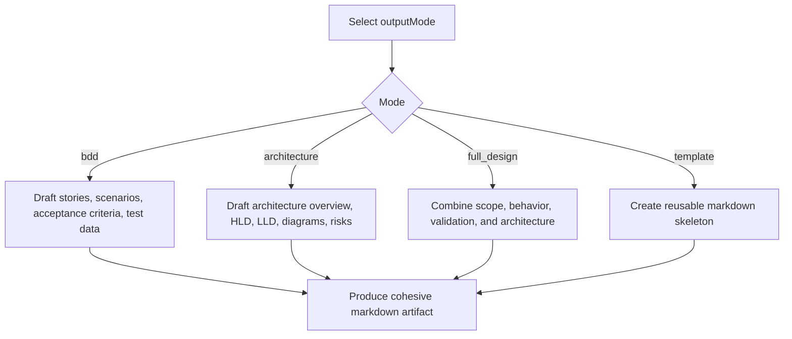

# Engineering Design Planning Skill Overview

## What This Skill Does
This skill drafts the main markdown artifact based on the selected `outputMode`.

## When To Use It
- Use it after intake and repo-context work are complete.
- Use it when the artifact needs to be structured for BDD, architecture, full design, or template output.

## Inputs It Expects
- feature summary
- assumptions
- repo context summary
- requested `outputMode`

## How It Works

## Outputs It Produces
- markdown draft
- section set matched to `outputMode`
- explicit assumptions

## Guardrails
- Do not force sections that do not fit the selected mode.
- Do not output JSON in this stage.

