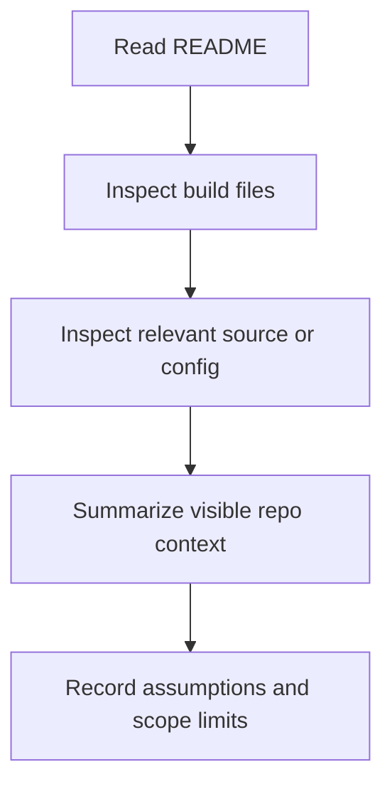

# Engineering Design Scope Skill Overview

## What This Skill Does
This skill reads repository context and records the facts, assumptions, and scope limits needed for repo-aware design output.

## When To Use It
- Use it after the requirement is clear enough to inspect the repository.
- Use it before making stack, architecture, or implementation claims.

## Inputs It Expects
- confirmed requirement
- README
- build files
- relevant source or config files
- user constraints, if any

## How It Works

## Outputs It Produces
- feature summary
- repo context summary
- assumptions
- scope boundaries
- context limits

## Guardrails
- Do not invent stack details that were not observed.
- Do not make architecture claims without repo evidence.

