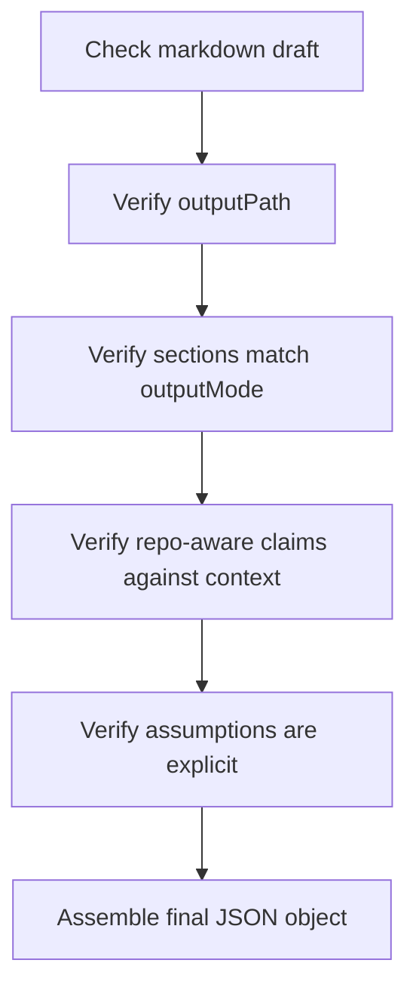

# Engineering Design Validation Skill Overview

## What This Skill Does
This skill validates the generated markdown artifact and assembles the required final JSON response.

## When To Use It
- Use it after the markdown draft exists.
- Use it before returning the final result to ensure the output contract is satisfied.

## Inputs It Expects
- draft markdown artifact
- requested `outputMode`
- repo context summary
- assumptions list
- intended `outputPath`

## How It Works

## Outputs It Produces
- `summary`
- `artifactType`
- `sectionsGenerated`
- `outputPath`
- `assumptions`

## Guardrails
- Do not emit prose outside the final JSON object.
- Do not claim repo alignment without evidence.

