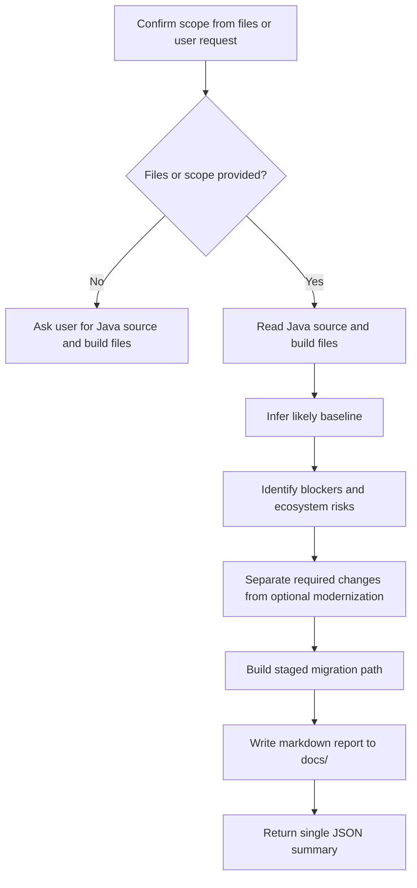

# Java 21 Upgrade Recommender Skill Overview

## What This Skill Does
This skill reviews Java source and build configuration, infers the likely current baseline, identifies migration blockers, and recommends a practical path to Java 21. It also writes a markdown report under `docs/` and returns a final JSON summary.

## When To Use It
- Use it for Java runtime and language modernization reviews.
- Use it when the project may still target Java 5, Java 8, Java 11 to 17, or a mixed baseline.
- Use it when you want staged upgrade advice before making code changes.

## When Not To Use It
- Do not use it as a build executor or refactoring engine.
- Do not use it to assert Java 21 compatibility without code, build, and dependency evidence.

## Inputs It Expects
- Java source files
- Maven or Gradle build files when available
- optional `analysisScope`
- optional `currentJavaVersion`
- optional `focusAreas`
- optional `targetJavaVersion`

## Intake Behavior
- If the user provides one or more files, analyze those files first and keep the review scoped to them unless the user asks for a broader assessment.
- If the user does not provide files or a clear scope, ask for the relevant Java source files and build files before proceeding.
- If only Java source files are provided and no build file is available, continue with source-level findings but lower confidence for baseline and compatibility conclusions.

## Method-Level Use
- This skill is primarily organized around file, package, module, or repository analysis.
- It can still be used for method-level analysis when the user provides the containing file and identifies the method by name or snippet.
- Method-level use should be treated as a narrow file-scoped review centered on that method, not as a full Java 21 migration assessment.
- Build and dependency conclusions remain limited unless a related `pom.xml`, `build.gradle`, or `build.gradle.kts` file is also provided.

## Example Prompts

### Method-Level Prompt
```text
Analyze the method `calculateInvoiceTotal` in `src/main/java/com/acme/billing/InvoiceService.java` for Java 21 upgrade readiness. Focus on deprecated APIs, compatibility risks, and safe modernization opportunities. Also consider `pom.xml` if needed.
```

### File-Level Prompt
```text
Review `src/main/java/com/acme/billing/InvoiceService.java` for Java 21 upgrade readiness. Identify the likely baseline, migration blockers, deprecated API usage, and optional Java 21 improvements. Use `pom.xml` and `build.gradle` if present.
```

### Workspace-Level Prompt
```text
Assess this workspace for Java 21 upgrade readiness. Review the Java source files and available build configuration, infer the current baseline, identify compatibility blockers, and produce a staged migration path with a markdown report under `docs/`.
```

## How It Works



## Outputs It Produces
- markdown report path under `docs/`
- inferred baseline with evidence
- prioritized issues and recommendations
- migration plan
- manual checks
- risk summary
- final JSON object

## Report Shape
The markdown report should cover:

- title
- analyzed scope
- detected baseline and evidence
- executive summary
- migration risk summary
- prioritized findings
- recommended migration path
- optional Java 21 modernization opportunities
- manual checks
- conclusion

## Classification Model
Use these labels where they help triage:

- `compatibility_blocker`
- `required_migration_change`
- `optional_modernization`
- `preview_only`

## Guardrails
- Do not modify source files.
- Do not proceed with a repository-wide assessment when the user has not provided files or a clear scope.
- Do not recommend preview features as default upgrade work.
- Do not hide uncertainty when build and source evidence disagree.
- Do not collapse dependency and runtime risk into source-only findings.
