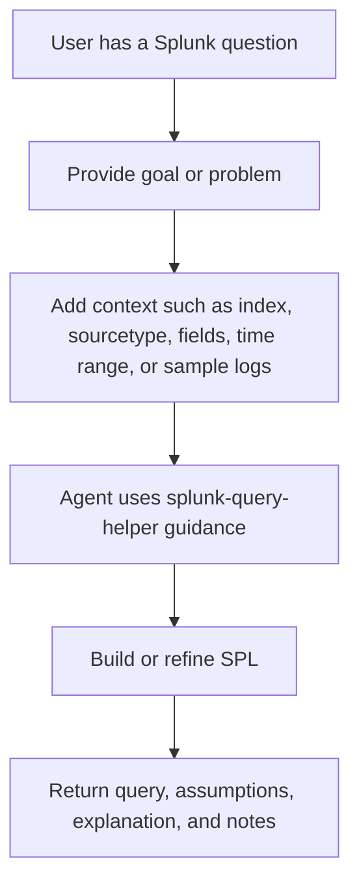
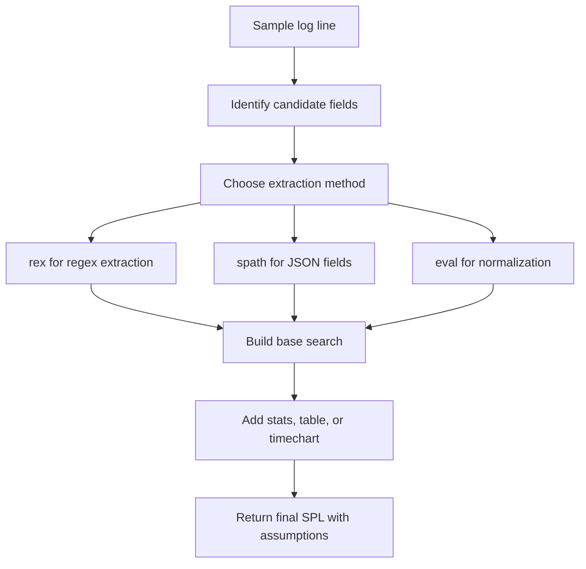
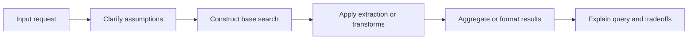

# Splunk Query Helper

This skill helps an agent write, explain, refine, and troubleshoot Splunk SPL queries.

It is intended for requests such as:

- writing a new Splunk query from an investigation goal
- improving an existing SPL query
- extracting fields from sample log lines
- building `stats`, `chart`, or `timechart` aggregations
- investigating slow searches or incorrect results

## What This Skill Does

The skill guides the agent to:

- identify the right base search using `index`, `sourcetype`, `source`, `host`, or known fields
- map the question to a likely SPL shape before writing the final query
- narrow the search before adding expensive transformations
- choose suitable SPL commands such as `search`, `where`, `eval`, `rex`, `spath`, `stats`, and `timechart`
- avoid common performance mistakes
- validate field existence, numeric coercion, and result shape
- return readable SPL with assumptions and notes

## How to Use It

Ask for Splunk help and either mention the skill name directly or provide a request that clearly matches it.

### Request Flow



Example prompts:

```text
Use splunk-query-helper to write a query for 500 errors by service over the last 24 hours.
```

```text
Use splunk-query-helper to optimize this SPL query and explain why it is slow.
```

```text
Use splunk-query-helper to extract fields from this sample log and build a query for slow requests.
```

```text
Use splunk-query-helper to trace a request ID across services and show the event sequence.
```

## Common Request Types

This skill is most useful for requests such as:

- show an error trend over time
- find the top failing endpoints
- trace one request across multiple services
- find slow APIs or p95 latency
- compare behavior before and after a deployment
- detect login failures or traffic spikes
- find events with missing or malformed fields

## Best Input Format

Provide as much of this as you know:

- goal or investigation question
- `index`
- `sourcetype`
- `source` or `host`
- sample log lines
- field names already known
- time range
- expected output shape
- whether logs are JSON, key-value, or plain text

Example:

```text
Use splunk-query-helper.

Goal: find slow checkout requests over 2 seconds
Index: app_logs
Sourcetype: service_logs
Time range: last 24 hours
Known fields: service, endpoint, duration_ms, request_id
Need: final SPL plus short explanation
```

## Choosing an Extraction Method

The skill does not assume regex first. It chooses extraction based on the log structure.

- Use existing fields if Splunk already extracts them.
- Use `spath` for JSON logs.
- Use existing key-value fields for `field=value` logs.
- Use `rex` only when the needed field is not already available.
- Use `eval` to normalize field names or convert strings to numbers.

## Example Log Input

If you provide a raw log line, the skill can help derive field extraction patterns.

### Log-to-Query Flow



Example log:

```text
2026-05-05 10:12:33 ERROR service=checkout requestId=abc-123 userId=42 duration_ms=2450 status=500 path=/api/payments
```

Example SPL approach:

```spl
index=app_logs sourcetype=service_logs
| rex "service=(?<service>\w+)"
| rex "requestId=(?<request_id>[A-Za-z0-9-]+)"
| rex "userId=(?<user_id>\d+)"
| rex "duration_ms=(?<duration_ms>\d+)"
| rex "status=(?<status>\d+)"
| rex "path=(?<path>\S+)"
| table _time service request_id user_id duration_ms status path
```

JSON-oriented example:

```spl
index=app_logs sourcetype=json_logs
| spath path=request.id output=request_id
| spath path=service.name output=service
| spath path=duration_ms output=duration_ms
| eval duration_ms=tonumber(duration_ms)
| table _time service request_id duration_ms
```

## What You Can Expect Back

Typical outputs include:

- a final SPL query
- assumptions the query depends on
- a short explanation of each pipeline stage
- performance or validation notes

The skill should also sanity-check:

- whether the base search is scoped correctly
- whether referenced fields exist
- whether numeric comparisons use numeric values
- whether the result shape matches the request

### Response Flow



## Common Anti-Patterns It Helps Avoid

- broad `index=*` searches
- using `transaction` when `stats` would work
- unnecessary `join` usage
- applying `rex` before checking existing fields
- using `table` too early and dropping needed fields
- comparing numeric values as strings

## Limits

This skill does not run Splunk by itself. It provides guidance for constructing good SPL.

It does not:

- ingest logs into Splunk
- create Splunk knowledge objects automatically
- validate against live data unless another tool or agent executes the query

## Files

- [SKILL.md](/Users/maheswarbuddolla/softwares/agents-skills-instructions1/github/skills/splunk-query-helper/SKILL.md)
