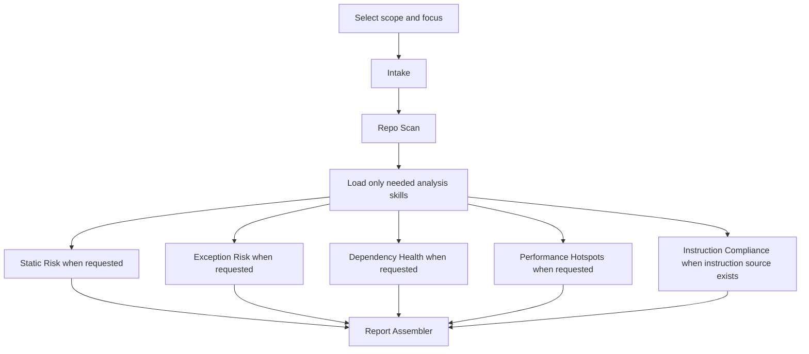

# Ultimate Codebase Analysis Skill Overview

## What This Skill Set Does
This skill set breaks repository-wide codebase analysis into independent skills that can run individually or be coordinated by an orchestrator agent.

## When To Use It 
- Use it for full repository review or diff review.
- Use it when you want to run one analysis concern directly, such as dependency health, exception risk, or performance hotspots.
- Use it when the analysis logic should stay reusable outside a single agent prompt.

## Skill Roles

### Coordinator Skill
- `ultimate-codebase-analysis`
  Selects scope, chooses the minimal downstream skill set, and coordinates progressive loading.

### Support Skills
- `ultimate-codebase-analysis-intake`
  Resolves `full_scan` or `diff_scan`, requested focus areas, instruction-source availability, and chunking need.
- `ultimate-codebase-analysis-repo-scan`
  Maps repository structure, modules, file types, and review chunks.
- `ultimate-codebase-analysis-report-assembler`
  Merges findings from multiple analysis skills into one final markdown report.

### Analysis Skills
- `ultimate-codebase-analysis-static-risk`
  Reviews correctness, safety, maintainability, testing-adjacent gaps, and security signals.
- `ultimate-codebase-analysis-exception-risk`
  Reviews exception handling, failure propagation, retry and fallback behavior, and diagnosability.
- `ultimate-codebase-analysis-dependency-health`
  Reviews dependency manifests, build configuration, version conflicts, and maintenance risk.
- `ultimate-codebase-analysis-performance-hotspots`
  Reviews likely static performance bottlenecks and concurrency signals.
- `ultimate-codebase-analysis-instruction-compliance`
  Verifies repository behavior against a provided instruction or policy source.

## Individual Skills

| Skill | Use |
|---|---|
| `ultimate-codebase-analysis` | Coordinate the full review flow and load the smallest set of downstream skills needed for the request. |
| `ultimate-codebase-analysis-intake` | Decide whether the review is `full_scan` or `diff_scan`, capture focus areas, and determine whether compliance and chunking are needed. |
| `ultimate-codebase-analysis-repo-scan` | Build the repository map, identify modules and file types, and prepare chunks for deeper review. |
| `ultimate-codebase-analysis-static-risk` | Review correctness, safety, maintainability, testing-adjacent gaps, and security signals visible in source code. |
| `ultimate-codebase-analysis-exception-risk` | Review exception handling, failure propagation, retries, fallback behavior, and diagnosability. |
| `ultimate-codebase-analysis-dependency-health` | Review dependency manifests, version conflicts, build drift, and maintenance risk in build configuration. |
| `ultimate-codebase-analysis-performance-hotspots` | Review likely performance bottlenecks, blocking I/O, query cost, allocation pressure, and concurrency signals. |
| `ultimate-codebase-analysis-instruction-compliance` | Review the repository against a provided instruction or policy source and report evidence-backed violations. |
| `ultimate-codebase-analysis-report-assembler` | Merge findings from multiple skills into one deduplicated final markdown report. |

## How It Works
Use the coordinator skill when you want guided sequencing. Use the smaller skills directly when the review focus is already known.

## Execution Modes

### Findings-Only Mode
Use this mode when a skill is feeding an orchestrator or the report assembler. In this mode, the skill returns structured findings and evidence.

### Standalone-Report Mode
Use this mode when an analysis skill is run directly and should produce its own focused markdown artifact.

The analysis skills support standalone focused reports:
- `ultimate-codebase-analysis-static-risk` -> `static-risk-report.md`
- `ultimate-codebase-analysis-exception-risk` -> `exception-risk-report.md`
- `ultimate-codebase-analysis-dependency-health` -> `dependency-health-report.md`
- `ultimate-codebase-analysis-performance-hotspots` -> `performance-hotspots-report.md`
- `ultimate-codebase-analysis-instruction-compliance` -> `instruction-compliance-report.md`

The coordinator and support skills do not produce standalone analysis reports:
- `ultimate-codebase-analysis`
- `ultimate-codebase-analysis-intake`
- `ultimate-codebase-analysis-repo-scan`

The final aggregator produces the consolidated report:
- `ultimate-codebase-analysis-report-assembler` -> `codebase-analysis-report.md`

## Independent Use
You can run the smaller skills individually when you already know the concern:
- dependency-only review
- exception-only review
- performance-only review
- static-risk-only review
- compliance-only review when an instruction source exists

Typical standalone usage pattern:
1. Run intake if the scope is unclear.
2. Run repo scan if the repository needs chunking or module mapping.
3. Run one analysis skill in `standalone-report` mode for focused output.
4. Run multiple analysis skills in `findings-only` mode when you plan to merge them later.
5. Run `ultimate-codebase-analysis-report-assembler` to generate `codebase-analysis-report.md` when you need one consolidated report.

## Inputs It Expects
- repository root
- optional diff scope or changed-file list
- optional instruction source
- optional focus area selection

## Outputs It Produces
- scope and chunking plan from intake and repo scan
- structured findings from analysis skills in `findings-only` mode
- focused markdown reports from analysis skills in `standalone-report` mode
- one consolidated markdown report from the report assembler

## Guardrails
- Do not invent repository structure, runtime behavior, exploitability, or coverage certainty.
- Do not run the compliance skill without an instruction source.
- Do not use the report assembler without upstream findings to merge.
- Do not mix focused analysis categories unless the evidence clearly overlaps.
- Do not treat static review as runtime proof.
